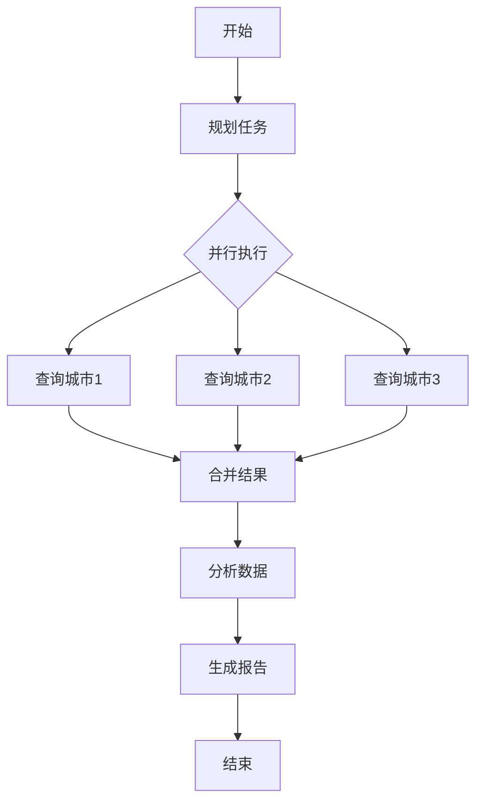

# 添加 Agent 工作流标准流程

本工作流用于在项目中添加新的 AI Agent 工作流，基于 **Spring AI Alibaba Graph** 框架。

## 参考实现

在开始前，先学习现有实现：
```bash
# JManus Agent 实现
cd spring-ai-alibaba/spring-ai-alibaba-jmanus

# DeepResearch Agent 实现
cd spring-ai-alibaba/spring-ai-alibaba-deepresearch

# Graph 示例
cd spring-ai-alibaba/spring-ai-alibaba-graph/spring-ai-alibaba-graph-example
```

---

## 工作流类型选择

根据需求选择合适的 Agent 模式：

| 类型 | 适用场景 | 复杂度 | 参考实现 |
|------|---------|--------|---------|
| **ReactAgent** | 通用任务，需要工具调用 | ⭐⭐ | `spring-ai-alibaba-graph` |
| **Sequential** | 任务需按顺序执行 | ⭐ | `Graph Example` |
| **Parallel** | 任务可并行处理 | ⭐⭐⭐ | `Graph Example` |
| **Routing** | 根据条件选择分支 | ⭐⭐⭐ | `Graph Example` |
| **Loop** | 迭代优化 | ⭐⭐⭐⭐ | `DeepResearch` |
| **Supervisor** | 管理多个子Agent | ⭐⭐⭐⭐⭐ | `JManus` |

---

## 阶段 1: 需求定义

### 1.1 明确 Agent 目标
- **输入**: 用户需求描述
- **输出**: Agent 规格文档

**示例**:
```markdown
## Agent 名称
WeatherAnalysisAgent

## 目标
分析多个城市的天气数据，生成对比报告

## 输入
- 城市列表: ["北京", "上海", "深圳"]
- 分析维度: 温度、湿度、空气质量

## 输出
- Markdown 格式的对比分析报告

## 工作流类型
Parallel (并行查询多个城市天气)
```

### 1.2 定义所需工具
列出Agent需要调用的 `@Tool` 方法：
```java
- getWeather(city: String) -> WeatherInfo
- getAirQuality(city: String) -> AirQualityInfo
- generateReport(data: List<CityData>) -> String
```

- **检查点**:
  - [ ] Agent 目标清晰
  - [ ] 工作流类型已选择
  - [ ] 所需工具已列举

---

## 阶段 2: 架构设计

### 2.1 状态图设计 (StateGraph)

使用 Mermaid 绘制工作流：


### 2.2 状态定义

定义 `AgentState` 类：
```java
@Data
public class WeatherAnalysisState extends AgentState {
    private List<String> cities;           // 输入
    private List<WeatherInfo> weatherData; // 中间状态
    private String report;                 // 输出
    private int iterations;                 // 迭代计数
}
```

- **检查点**:
  - [ ] 状态图已绘制
  - [ ] 输入、中间状态、输出已定义

---

## 阶段 3: 实现 Agent

### 3.1 创建 Agent 类

**目录结构**:
```
src/main/java/com/example/agent/
├── WeatherAnalysisAgent.java
├── WeatherAnalysisState.java
└── config/
    └── WeatherAgentConfig.java
```

**Agent 实现模板**:
```java
package com.example.agent;

import com.alibaba.cloud.ai.graph.StateGraph;
import com.alibaba.cloud.ai.graph.node.LlmNode;
import com.alibaba.cloud.ai.graph.node.ToolNode;
import lombok.extern.slf4j.Slf4j;
import org.springframework.ai.chat.client.ChatClient;
import org.springframework.stereotype.Component;

import java.util.Map;

import static com.alibaba.cloud.ai.graph.StateGraph.END;
import static com.alibaba.cloud.ai.graph.StateGraph.START;

/**
 * 天气分析 Agent
 * 
 * 功能: 并行查询多个城市天气，生成对比报告
 * 
 * @author AI Assistant
 * @version 1.0
 */
@Slf4j
@Component
public class WeatherAnalysisAgent {
    
    private final StateGraph graph;
    private CompiledGraph compiledGraph;
    
    public WeatherAnalysisAgent(
            ChatClient chatClient,
            ToolNode toolNode) {
        
        this.graph = buildGraph(chatClient, toolNode);
    }
    
    /**
     * 构建状态图
     */
    private StateGraph buildGraph(ChatClient chatClient, ToolNode toolNode) {
        var graph = new StateGraph();
        
        // 1. 规划节点
        var planNode = LlmNode.builder()
                .name("plan")
                .chatClient(chatClient)
                .systemPrompt("分析用户输入，规划任务")
                .build();
        
        // 2. 执行节点（调用工具）
        var executeNode = toolNode;
        
        // 3. 分析节点
        var analyzeNode = LlmNode.builder()
                .name("analyze")
                .chatClient(chatClient)
                .systemPrompt("分析天气数据，找出规律")
                .build();
        
        // 4. 报告节点
        var reportNode = LlmNode.builder()
                .name("report")
                .chatClient(chatClient)
                .systemPrompt("生成 Markdown 格式的对比报告")
                .build();
        
        // 添加节点
        graph.addNode("plan", planNode);
        graph.addNode("execute", executeNode);
        graph.addNode("analyze", analyzeNode);
        graph.addNode("report", reportNode);
        
        // 定义边（控制流）
        graph.addEdge(START, "plan");
        graph.addEdge("plan", "execute");
        graph.addEdge("execute", "analyze");
        graph.addEdge("analyze", "report");
        graph.addEdge("report", END);
        
        return graph;
    }
    
    /**
     * 执行 Agent
     * 
     * @param input 输入参数
     * @return 分析报告
     */
    public String execute(Map<String, Object> input) {
        log.info("WeatherAnalysisAgent 开始执行, 输入: {}", input);
        
        if (compiledGraph == null) {
            compiledGraph = graph.compile();
        }
        
        var result = compiledGraph.invoke(input);
        
        log.info("WeatherAnalysisAgent 执行完成");
        return result.get("report").toString();
    }
}
```

### 3.2 配置 ChatClient

在 `WeatherAgentConfig.java` 中：
```java
@Configuration
public class WeatherAgentConfig {
    
    @Bean
    public ChatClient weatherChatClient(
            @Qualifier("yourChatModel") ChatModel chatModel) {
        return ChatClient.builder(chatModel)
                .defaultSystem("你是一个专业的天气分析助手")
                .build();
    }
    
    @Bean
    public ToolNode weatherToolNode(List<ToolCallback> tools) {
        return new ToolNode("weather-tools", tools);
    }
}
```

- **检查点**:
  - [ ] Agent 类已创建
  - [ ] StateGraph 已构建
  - [ ] ChatClient 已配置

---

## 阶段 4: 高级模式实现

### 4.1 添加条件路由

```java
// 在 buildGraph() 中
graph.addConditionalEdges("execute",
    state -> needMoreData(state) ? "execute" : "analyze",
    Map.of(
        "execute", "execute",  // 循环
        "analyze", "analyze"   // 继续
    )
);

private boolean needMoreData(OverAllState state) {
    // 判断逻辑
    return state.getIterations() < 3;
}
```

### 4.2 添加 Human-in-the-Loop

```java
// 添加中断点
graph.addNode("human-review", new InterruptNode());

graph.addEdge("analyze", "human-review");
graph.addEdge("human-review", "report");

// 使用时
var config = CompileConfig.builder()
        .checkpointer(new MemorySaver())
        .build();

var compiled = graph.compile(config);

// 执行到中断点
var threadId = "weather-analysis-001";
compiled.invoke(input, RunnableConfig.builder().threadId(threadId).build());

// 人工审核后继续
compiled.invoke(null, RunnableConfig.builder().threadId(threadId).build());
```

### 4.3 添加并行执行

参考 Spring AI Alibaba Graph 的并行模式：
```java
// 创建并行节点组
var parallelBranch = ParallelBranch.builder()
        .addBranch("city1", node1)
        .addBranch("city2", node2)
        .addBranch("city3", node3)
        .build();

graph.addNode("parallel", parallelBranch);
```

---

## 阶段 5: 测试

### 5.1 单元测试

```java
@SpringBootTest
class WeatherAnalysisAgentTest {
    
    @Autowired
    private WeatherAnalysisAgent agent;
    
    @Test
    void testExecute() {
        var input = Map.of(
            "cities", List.of("北京", "上海", "深圳")
        );
        
        var result = agent.execute(input);
        
        assertNotNull(result);
        assertTrue(result.contains("北京"));
        assertTrue(result.contains("对比"));
    }
}
```

### 5.2 集成测试

创建 REST API 测试：
```java
@RestController
@RequestMapping("/api/weather-agent")
public class WeatherAgentController {
    
    @Autowired
    private WeatherAnalysisAgent agent;
    
    @PostMapping("/analyze")
    public String analyze(@RequestBody AnalysisRequest request) {
        return agent.execute(Map.of(
            "cities", request.getCities()
        ));
    }
}
```

测试：
// turbo
```bash
curl -X POST http://localhost:8080/api/weather-agent/analyze \
  -H 'Content-Type: application/json' \
  -d '{
    "cities": ["北京", "上海"]
  }'
```

---

## 阶段 6: 可视化与调试

### 6.1 导出状态图

```java
// 导出为 Mermaid 格式
var mermaid = graph.exportToMermaid();
System.out.println(mermaid);

// 导出为 PlantUML 格式
var plantuml = graph.exportToPlantUML();
System.out.println(plantuml);
```

### 6.2 添加日志

在关键节点添加日志：
```java
var planNode = LlmNode.builder()
        .name("plan")
        .chatClient(chatClient)
        .systemPrompt("规划任务")
        .postNodeHook(state -> {
            log.info("规划节点执行完成, 状态: {}", state);
            return state;
        })
        .build();
```

---

## 阶段 7: 优化与文档

### 7.1 性能优化

- **缓存**: 对重复查询使用缓存
- **异步执行**: 使用 `AsyncNodeAction` 
- **超时控制**: 设置节点超时时间

### 7.2 编写文档

创建 `agent/WeatherAnalysisAgent.md`:
```markdown
# WeatherAnalysisAgent

## 功能
并行查询多个城市天气，生成对比分析报告

## 使用方法
...

## 工作流图
[Mermaid 图]

## API 文档
...
```

---

## 输出物清单

- [x] Agent 类实现
- [x] StateGraph 定义
- [x] 单元测试（覆盖率 > 80%）
- [x] 集成测试
- [x] API 文档
- [x] 工作流可视化图
- [x] 性能测试报告

---

## 参考 Spring AI Alibaba 最佳实践

### 1. 状态管理
```java
// 使用 OverAllStateFactory 创建状态
var stateFactory = OverAllStateFactory.builder()
        .addMessageKey("messages")
        .addField("cities", List.class)
        .build();
```

### 2. 工具集成
```java
// 动态加载工具
@Autowired
private List<ToolCallback> tools;

var agent = ReactAgent.builder()
        .tools(tools)  // 自动发现所有 @Tool
        .build();
```

### 3. 上下文工程
```java
// 优化 Prompt
var chatClient = ChatClient.builder(chatModel)
        .defaultSystem("""
            你是一个专业的天气分析师。
            
            分析要求:
            1. 客观准确
            2. 数据对比清晰
            3. 给出实用建议
            """)
        .build();
```

---

## 常见模式速查

### ReactAgent 模式
```java
ReactAgent.builder()
    .name("my-agent")
    .chatClient(chatClient)
    .tools(tools)
    .maxIterations(10)
    .build();
```

### Supervisor 模式
```java
SupervisorAgent.builder()
    .mainAgent(mainAgent)
    .subAgents(List.of(agent1, agent2))
    .router(routingLogic)
    .build();
```

### Loop 模式
```java
graph.addConditionalEdges("execute",
    state -> state.getIterations() < maxIterations,
    Map.of(true, "execute", false, END)
);
```

---

**工作流版本**: 1.0  
**最后更新**: 2026-01-28  
**参考框架**: Spring AI Alibaba Graph  
**适用LLM**: Claude Sonnet 4.5 / Gemini / GPT-4 / DeepSeek
