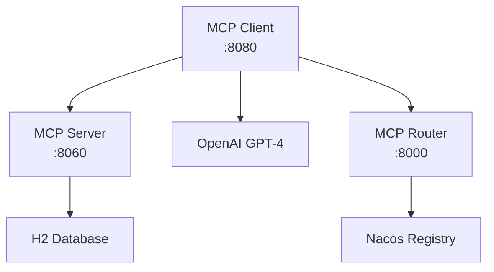

# MCP Router Project with Spring AI

This project demonstrates the Model Context Protocol (MCP) implementation using Spring AI, featuring a multi-module architecture with MCP router, client, and server components.

## Project Structure

```
mcp-router-parent/
├── mcp-router/          # Nacos-based MCP router and registry
├── mcp-client/          # MCP client with Spring AI ChatClient
├── mcp-server/          # MCP server exposing @Tool methods
└── README.md
```

## Modules

### 1. MCP Router (`mcp-router`)
- **Purpose**: Central registry and router for MCP servers using Nacos
- **Port**: 8000
- **Features**:
  - Service discovery with Nacos
  - Server registration and management
  - Search capabilities across registered servers
  - RESTful API for server operations

### 2. MCP Server (`mcp-server`)
- **Purpose**: Example MCP server exposing tools via Spring AI
- **Port**: 8060
- **Features**:
  - Person management tools using Spring AI `@Tool` annotations
  - H2 in-memory database with sample data
  - WebFlux-based MCP server implementation
  - Tools for finding, counting, and listing persons

### 3. MCP Client (`mcp-client`)
- **Purpose**: Client application consuming MCP server tools
- **Port**: 8080
- **Features**:
  - Spring AI ChatClient integration
  - RESTful endpoints for interacting with AI + MCP tools
  - DeepSeek integration for natural language queries
  - SSE connection to MCP server

## Quick Start

### Prerequisites
- Java 17+
- Maven 3.6+
- DeepSeek API Key (for client)
- Nacos Server (for router, optional)

### 1. Start MCP Server
```bash
cd mcp-server
mvn spring-boot:run
```
Server starts on http://localhost:8060

### 2. Start MCP Client
```bash
# Set your DeepSeek API key
export DEEPSEEK_API_KEY=your-deepseek-api-key

cd mcp-client
mvn spring-boot:run
```
Client starts on http://localhost:8080

### 3. Test the Integration

**List all persons:**
```bash
curl http://localhost:8080/persons/all
```

**Find persons by nationality:**
```bash
curl http://localhost:8080/persons/nationality/German
```

**Count persons by nationality:**
```bash
curl http://localhost:8080/persons/count-by-nationality/French
```

**Custom query:**
```bash
curl -X POST http://localhost:8080/persons/query \
  -H "Content-Type: application/json" \
  -d '{"query": "Who is the oldest person in the database?"}'
```

## MCP Server Tools

The MCP server exposes the following Spring AI tools:

1. **getPersonById**: Find person by ID
2. **getPersonsByNationality**: Find all persons by nationality
3. **getAllPersons**: List all persons
4. **countPersonsByNationality**: Count persons by nationality

## Configuration

### MCP Client Configuration (`mcp-client/src/main/resources/application.yml`)
```yaml
spring:
  ai:
    openai:
      api-key: ${DEEPSEEK_API_KEY}
      base-url: https://api.deepseek.com
      chat:
        model: deepseek-chat
    mcp:
      client:
        sse:
          connections:
            person-mcp-server:
              url: http://localhost:8060
```

### MCP Server Configuration (`mcp-server/src/main/resources/application.yml`)
```yaml
spring:
  ai:
    mcp:
      server:
        name: person-mcp-server
        version: 1.0.0
```

## Architecture



## Sample Data

The H2 database contains sample persons from various nationalities:
- American, British, German, French, Japanese, Italian
- Each person has: ID, first/last name, age, nationality, gender

## Development

### Build All Modules
```bash
mvn clean install
```

### Run Tests
```bash
mvn test
```

### Run with Docker (Future Enhancement)
```bash
docker-compose up
```

## Spring AI MCP Features

This project demonstrates:

1. **Tool Definition**: Using `@Tool` annotations in Spring AI
2. **MCP Server**: WebFlux-based MCP server with Spring Boot
3. **MCP Client**: SSE-based client connection
4. **Tool Integration**: Automatic tool discovery and execution
5. **ChatClient**: Integration with DeepSeek for natural language queries

## References

- [Model Context Protocol](https://modelcontextprotocol.io/)
- [Spring AI MCP Documentation](https://docs.spring.io/spring-ai/reference/api/mcp/)
- [Nacos Documentation](https://nacos.io/en/)
- [Spring Boot Documentation](https://spring.io/projects/spring-boot)

## License

Apache License 2.0 