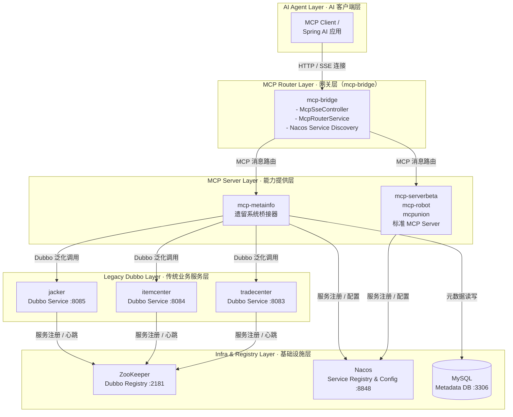

# 系统架构深度分析

> **项目名称**: MCP Router SSE Parent  
> **分析日期**: 2026-02-11  
> **分析目标**: 系统架构、模块详解、数据流、重要节点

---

## 目录

1. [系统概述](#1-系统概述)
2. [整体架构](#2-整体架构)
3. [核心模块详解](#3-核心模块详解)
4. [数据流分析](#4-数据流分析)
5. [重要技术节点](#5-重要技术节点)
6. [数据库设计](#6-数据库设计)
7. [部署架构](#7-部署架构)

---

## 1. 系统概述

### 1.1 项目定位

本项目是一个**基于 MCP (Model Context Protocol) 标准的企业级微服务-AI集成平台**，核心使命是：

**将传统企业的 Dubbo/Spring Cloud 微服务体系转换为 AI Agent 可调用的工具集合**

### 1.2 核心价值

| 维度 | 价值主张 |
|------|---------|
| **协议转换** | Dubbo RPC → MCP Standard Tools |
| **服务发现** | ZooKeeper/Nacos → 统一服务注册中心 |
| **AI集成** | 让 AI 大模型能够直接调用企业后端业务逻辑 |
| **安全治理** | 服务审批、白名单、权限控制 |
| **虚拟编排** | 动态组合多个 Dubbo 服务为虚拟项目 |

### 1.3 技术栈

```
核心框架: Spring Boot 3.2.5 + Java 17
RPC框架: Dubbo 3.2.8
注册中心: Nacos 3.0.1 + ZooKeeper 3.5.10
AI集成: Spring AI 1.0.0 + Spring AI Alibaba 1.0.0.3
数据库: MySQL 8.0 + MyBatis 3.0.3
通信协议: SSE (Server-Sent Events)
反应式编程: Spring WebFlux + Project Reactor
```

---

## 2. 整体架构

### 2.1 架构分层图

> 下图从 **分层视角** 展示了 AI 客户端、MCP 网关、MCP Server、Dubbo 传统服务与底层基础设施之间的关系，便于在架构评审和汇报中直接使用。



### 2.2 核心交互流程

#### 流程 1: AI 调用 Dubbo 服务（完整链路）

```
1. AI Client 发起 SSE 连接
   └─> GET http://localhost:8052/sse/{endpoint}
   
2. mcp-bridge 收到连接请求
   ├─> 从 Nacos 查询 endpoint 对应的 MCP Server
   ├─> 验证服务是否在线
   └─> 返回 endpoint event（包含 SSE URL）

3. AI Client 发送 initialize 请求
   └─> POST http://localhost:8052/mcp/{endpoint}/message
       Body: {"jsonrpc":"2.0","method":"initialize",...}

4. mcp-bridge 转发到 mcp-me ta info
   └─> POST http://localhost:9091/mcp/message?endpoint={endpoint}

5. mcp-metainfo 返回 capabilities
   └─> {"tools": {...}, "prompts": {...}, "resources": {...}}

6. AI Client 发送 tools/list 请求
   └─> POST http://localhost:8052/mcp/{endpoint}/message
       Body: {"jsonrpc":"2.0","method":"tools/list"}

7. mcp-metainfo 查询数据库 + 缓存
   ├─> 从 zk_project 查找项目
   ├─> 从 zk_project_service 查找关联服务
   ├─> 从 zk_dubbo_service_method 查找方法
   ├─> 从 zk_dubbo_method_parameter 读取参数 Schema
   └─> 返回 MCP Tool 列表

8. AI Client 选择工具并调用
   └─> POST /mcp/{endpoint}/message
       Body: {"method":"tools/call","params":{"name":"getUserById","arguments":{"id":1}}}

9. mcp-metainfo.McpExecutorService 执行调用
   ├─> 解析 toolName (interface.method)
   ├─> 从数据库/Nacos 获取 Provider 地址
   ├─> 创建 Dubbo Generic Service Reference
   ├─> 转换参数类型（JSON → Java Object）
   ├─> 执行泛化调用: genericService.$invoke(methodName, paramTypes, args)
   └─> 返回结果

10. demo-provider 处理请求
    ├─> Dubbo Protocol 接收调用
    ├─> 执行业务逻辑 (UserServiceImpl.getUserById(1))
    └─> 返回 User 对象

11. 结果逐层返回
    └─> demo-provider → mcp-metainfo → mcp-bridge → AI Client
```

---

## 3. 核心模块详解

### 3.1 mcp-bridge (MCP Gateway)

**角色**: 统一网关，连接 AI 客户端与多个 MCP Server

#### 核心功能

| 功能模块 | 实现类 | 说明 |
|---------|--------|------|
| **SSE 连接管理** | `McpSseController` | 管理 AI Client 的 SSE 长连接 |
| **服务发现** | `McpRouterService` | 从 Nacos 动态发现 MCP Server |
| **请求路由** | `McpRouterService` | 根据 endpoint 路由到具体 Server |
| **工具聚合** | `SmartMcpRouterService` | 聚合多个 Server 的工具列表 |
| **会话管理** | `McpSessionService` | 管理 SSE 会话状态 |
| **健康检查** | `HealthCheckService` | 定期检测 Server 可用性 |

#### 关键配置

```yaml
spring:
  ai:
    alibaba:
      mcp:
        nacos:
          server-addr: localhost:8848
          namespace: public
          group: DEFAULT_GROUP
```

#### 数据库表

```sql
CREATE TABLE mcp_servers (
  id BIGINT PRIMARY KEY,
  service_name VARCHAR(200),
  version VARCHAR(50),
  status VARCHAR(20),
  tools_count INT,
  last_heartbeat DATETIME
);
```

---

### 3.2 mcp-metainfo (Legacy System Bridge)

**角色**: Dubbo 服务适配器，将 ZooKeeper 中的 Dubbo 服务转换为 MCP Tools

#### 核心服务矩阵

| 服务类 | 职责 | 关键方法 |
|--------|------|---------|
| **ZooKeeperService** | 监听 ZooKeeper 节点变化 | `watchServiceProviders()` `parseProviderUrl()` |
| **DubboServiceDbService** | 服务元数据持久化 | `saveOrUpdateService()` `findApprovedServices()` |
| **McpExecutorService** | 执行 Dubbo 泛化调用 | `executeToolCall()` `convertParameters()` |
| **NacosMcpRegistrationService** | 注册到 Nacos | `registerVirtualProject()` `publishConfigsToNacos()` |
| **VirtualProjectService** | 虚拟项目管理 | `createVirtualProject()` `updateServices()` |
| **HeartbeatMonitorService** | Provider 健康检测 | `performHeartbeatCheck()` `handleOfflineProvider()` |
| **ServiceApprovalService** | 服务审批流程 | `approveService()` `rejectService()` |

#### 数据转换流水线

```
ZooKeeper Provider URL
  └─> ProviderInfo (解析)
     └─> DubboServiceEntity (持久化)
        └─> McpTool (协议转换)
           └─> Nacos Config (注册)
```

#### URL 解析示例

```
输入:
dubbo://127.0.0.1:20880/com.example.UserService?version=1.0.0&methods=getUserById,getAllUsers

输出 ProviderInfo:
{
  "interfaceName": "com.example.UserService",
  "version": "1.0.0",
  "address": "127.0.0.1:20880",
  "methods": ["getUserById", "getAllUsers"]
}
```

---

### 3.3 虚拟项目 (Virtual Project)

**概念**: 将多个 Dubbo 服务的方法组合成一个逻辑单元，对外暴露为一个 MCP Endpoint

#### 虚拟项目生命周期

```
1. 创建虚拟项目
   POST /api/virtual-projects
   {
     "name": "用户数据分析",
     "endpointName": "user-analytics",
     "services": [
       {"interface": "com.example.UserService", "version": "1.0.0", "methods": ["getUserById"]},
       {"interface": "com.example.AnalyticsService", "version": "2.0.0", "methods": ["analyze"]}
     ]
   }

2. 持久化到数据库
   └─> zk_project (项目基本信息)
   └─> zk_virtual_project_endpoint (Endpoint 映射)
   └─> zk_project_service (服务关联)

3. 注册到 Nacos
   └─> 服务名: virtual-user-analytics
   └─> 元数据: sseEndpoint=/sse/user-analytics
   └─> 配置中心:
       ├─> mcp-server-{serviceId}-tools.json (工具列表)
       ├─> mcp-server-{serviceId}-versions.json (版本信息)
       └─> mcp-server-{serviceId}-server.json (服务器信息)

4. AI Client 连接
   └─> GET http://localhost:8052/sse/user-analytics
   └─> mcp-bridge 从 Nacos 发现服务
   └─> 转发请求到 mcp-metainfo
   └─> mcp-metainfo 查询数据库获取工具列表
   └─> 返回聚合后的工具
```

---

## 4. 数据流分析

### 4.1 服务发现数据流

```
┌─────────────────┐
│  demo-provider  │
│  启动           │
└────────┬────────┘
         │ 1. 注册服务
         ▼
┌─────────────────────────────────────┐
│  ZooKeeper                          │
│  /dubbo/com.example.UserService/    │
│    providers/                       │
│      dubbo://127.0.0.1:20880/...    │
└────────┬────────────────────────────┘
         │ 2. Watcher 触发
         ▼
┌─────────────────────────────────────┐
│  mcp-metainfo.ZooKeeperService            │
│  - watchServiceProviders()          │
│  - handleProviderAdded()            │
└────────┬────────────────────────────┘
         │ 3. 解析 + 持久化
         ▼
┌─────────────────────────────────────┐
│  MySQL                              │
│  - zk_dubbo_service                 │
│  - zk_dubbo_service_node            │
│  - zk_dubbo_service_method          │
└────────┬────────────────────────────┘
         │ 4. 审批后注册
         ▼
┌─────────────────────────────────────┐
│  Nacos                              │
│  - 服务实例注册                      │
│  - 配置中心存储 Tools Schema        │
└─────────────────────────────────────┘
```

### 4.2 工具调用数据流

```
AI Client
   │ tools/call
   ▼
mcp-bridge
   │ 路由到 mcp-metainfo
   ▼
mcp-metainfo.McpMessageController
   │ 解析请求
   ▼
McpExecutorService.executeToolCall()
   │
   ├─> 1. 解析 toolName
   │      "com.example.UserService.getUserById"
   │         └─> interface: com.example.UserService
   │         └─> method: getUserById
   │
   ├─> 2. 获取参数类型
   │      ├─> 优先级 1: ZooKeeper Metadata
   │      ├─> 优先级 2: Database (zk_dubbo_method_parameter)
   │      └─> 优先级 3: 启发式推断
   │
   ├─> 3. 转换参数
   │      {"id": 1} → Object[] {1}
   │      推断类型: ["java.lang.Long"]
   │
   ├─> 4. 创建/获取 Generic Service Reference
   │      ReferenceConfig<GenericService> reference = new ReferenceConfig<>();
   │      reference.setInterface("com.example.UserService");
   │      reference.setVersion("1.0.0");
   │      reference.setGeneric("true");
   │      GenericService service = reference.get();
   │
   └─> 5. 执行泛化调用
       Object result = service.$invoke(
         "getUserById",
         new String[]{"java.lang.Long"},
         new Object[]{1L}
       );
         │
         ▼
   ┌─────────────────┐
   │  Dubbo Protocol │
   │  Network Call   │
   └────────┬────────┘
            ▼
   ┌─────────────────┐
   │ demo-provider   │
   │ UserServiceImpl │
   │ .getUserById(1) │
   └────────┬────────┘
            │
            ▼ 返回 User{id:1, name:"张三"}
```

### 4.3 心跳检测数据流

```
┌────────────────────────────────────────┐
│  HeartbeatMonitorService              │
│  @Scheduled(fixedRate = 30000)        │
│  performHeartbeatCheck()              │
└────────┬───────────────────────────────┘
         │ 每 30 秒
         ▼
┌────────────────────────────────────────┐
│  查询所有在线节点                       │
│  SELECT * FROM zk_dubbo_service_node  │
│  WHERE is_online = 1                  │
└────────┬───────────────────────────────┘
         │
         ▼
┌────────────────────────────────────────┐
│  并发检测节点可达性                     │
│  for (node : nodes) {                 │
│    CompletableFuture.supplyAsync(() → │
│      isProviderReachable(node.address)│
│    )                                  │
│  }                                    │
└────────┬───────────────────────────────┘
         │
         ├─► 成功: 更新 last_heartbeat_time
         │
         └─► 失败: 连续失败 > 5 分钟
                  │
                  ▼
           ┌──────────────────────────────┐
           │  handleOfflineProvider()     │
           │  1. 标记节点离线              │
           │  2. 从数据库移除              │
           │  3. 从 Nacos 注销服务         │
           └──────────────────────────────┘
```

---

## 5. 重要技术节点

### 5.1 MCP Schema 生成（启发式推断）

**问题**: Dubbo URL 只包含方法名，缺少参数名和类型信息

**解决方案**: 三级降级策略

```java
// 级别 1: ZooKeeper Metadata (Dubbo 2.7+)
String[] getParameterTypesFromMetadata(String interface, String method) {
  String metadataPath = "/dubbo/metadata/" + interface + "/" + method;
  String json = zkClient.getData().forPath(metadataPath);
  return parseParameterTypes(json);
}

// 级别 2: Database Repository
String[] getParameterTypesFromDatabase(String interface, String method) {
  List<Parameter> params = parameterMapper.selectByMethod(interface, method);
  return params.stream()
    .sorted(Comparator.comparing(Parameter::getOrder))
    .map(Parameter::getType)
    .toArray(String[]::new);
}

// 级别 3: Heuristic Inference (启发式推断)
String[] inferParameterTypes(String methodName, Object[] args) {
  if (methodName.matches("get.*ById")) {
    return new String[]{"java.lang.Long"}; // ID 通常是 Long
  } else if (methodName.matches("create.*|save.*")) {
    // 创建/保存方法通常接收实体对象
    String entityType = extractEntityTypeFromMethodName(methodName);
    return new String[]{"com.example.entity." + entityType};
  } else {
    // 根据参数值的运行时类型推断
    return Arrays.stream(args)
      .map(arg → arg.getClass().getName())
      .toArray(String[]::new);
  }
}
```

### 5.2 Dubbo 泛化调用陷阱

**问题 1: 参数类型不匹配**

```java
// ❌ 错误: 传递 int，但方法签名是 Long
service.$invoke("getUserById", new String[]{"int"}, new Object[]{1});
// 异常: NoSuchMethodException: getUserById(int)

// ✅ 正确: 类型精确匹配
service.$invoke("getUserById", new String[]{"java.lang.Long"}, new Object[]{1L});
```

**问题 2: POJO 对象传递**

```java
// ❌ 错误: 不能直接传递 POJO
User user = new User("张三", 25);
service.$invoke("createUser", new String[]{"com.example.User"}, new Object[]{user});
// 异常: ClassNotFoundException (Provider 侧找不到 User 类)

// ✅ 正确: 使用 Map 表示 POJO
Map<String, Object> userMap = new HashMap<>();
userMap.put("name", "张三");
userMap.put("age", 25);
service.$invoke("createUser", new String[]{"com.example.User"}, new Object[]{userMap});
```

### 5.3 SSE 连接超时优化

**原始问题**: mcp-bridge 初始化超时设置为 200ms，导致频繁失败

```java
// 修改前: McpClientManager.java
private static final int INIT_TIMEOUT_MS = 200;

// 修改后: 根据网络环境调整
private static final int INIT_TIMEOUT_MS = 2000; // 2 秒
private static final int CONNECTION_TIMEOUT_MS = 5000; // 5 秒
private static final int RESOURCE_LIST_TIMEOUT_MS = 3000; // 3 秒
```

### 5.4 Nacos 服务注册一致性

**挑战**: 虚拟项目需要在多个地方保持一致的服务名

```
数据库: zk_virtual_project_endpoint.endpoint_name = "user-analytics"
Nacos 服务名: "virtual-user-analytics"
Nacos Metadata: sseEndpoint = "/sse/user-analytics"
配置中心 Key: "mcp-server-{serviceId}-tools.json"
```

**实现**:

```java
// 统一命名规则
String endpointName = "user-analytics";
String nacosServiceName = "virtual-" + endpointName;
String sseEndpoint = "/sse/" + endpointName;
String serviceId = UUID.nameUUIDFromBytes(nacosServiceName.getBytes()).toString();
```

---

## 6. 数据库设计

### 6.1 核心表结构

#### zk_dubbo_service (Dubbo 服务表)

```sql
CREATE TABLE `zk_dubbo_service` (
  `id` bigint PRIMARY KEY AUTO_INCREMENT,
  `interface_name` varchar(250) NOT NULL COMMENT '服务接口名',
  `protocol` varchar(50) COMMENT '协议类型',
  `version` varchar(50) COMMENT '服务版本',
  `group` varchar(100) COMMENT '服务分组',
  `application` varchar(200) COMMENT '应用名称',
  `approval_status` varchar(20) NOT NULL DEFAULT 'INIT' 
    COMMENT '审批状态: INIT, PENDING, APPROVED, REJECTED',
  `provider_count` int NOT NULL DEFAULT 0,
  `online_provider_count` int NOT NULL DEFAULT 0,
  UNIQUE KEY `uk_service` (`interface_name`,`protocol`,`version`,`group`,`application`)
) COMMENT='Dubbo服务表';
```

**关键索引**:
- `uk_service`: 保证服务唯一性
- `idx_approval_status`: 快速查询已审批服务

#### zk_dubbo_service_method (服务方法表)

```sql
CREATE TABLE `zk_dubbo_service_method` (
  `id` bigint PRIMARY KEY AUTO_INCREMENT,
  `service_id` bigint NOT NULL COMMENT '关联的服务ID',
  `interface_name` varchar(500) NOT NULL,
  `method_name` varchar(200) NOT NULL,
  `return_type` varchar(500),
  `method_description` text COMMENT '方法描述（人工维护）',
  UNIQUE KEY `uk_service_method` (`service_id`,`method_name`)
) COMMENT='Dubbo服务方法表';
```

#### zk_dubbo_method_parameter (方法参数表)

```sql
CREATE TABLE `zk_dubbo_method_parameter` (
  `id` bigint PRIMARY KEY AUTO_INCREMENT,
  `method_id` bigint NOT NULL,
  `parameter_name` varchar(200),
  `parameter_type` varchar(500) NOT NULL,
  `parameter_order` int NOT NULL,
  `parameter_description` text,
  `parameter_schema_json` text COMMENT 'JSON Schema for nested structures',
  UNIQUE KEY `uk_method_param_order` (`method_id`,`parameter_order`)
) COMMENT='Dubbo方法参数表';
```

**parameter_schema_json 示例**:

```json
{
  "type": "object",
  "properties": {
    "name": {"type": "string", "description": "用户名"},
    "age": {"type": "integer", "description": "年龄"},
    "address": {
      "type": "object",
      "properties": {
        "city": {"type": "string"},
        "street": {"type": "string"}
      }
    }
  },
  "required": ["name"]
}
```

### 6.2 表关系图

```
zk_dubbo_service (1) ──┬── (N) zk_dubbo_service_node
                       │
                       ├── (N) zk_dubbo_service_method (1) ── (N) zk_dubbo_method_parameter
                       │
                       └── (N) zk_service_approval

zk_project (1) ──┬── (N) zk_project_service
                 │
                 └── (1) zk_virtual_project_endpoint

zk_interface_whitelist (独立表，用于服务过滤)
```

---

## 7. 部署架构

### 7.1 本地开发环境

```bash
# 启动顺序
./start-all-projects.sh

# 1. ZooKeeper (手动启动)
zkServer.sh start

# 2. Nacos (手动启动)
startup.sh -m standalone

# 3. MySQL (手动启动)
mysql.server start

# 4. mcp-metainfo (自动启动)
cd zk-mcp-parent/mcp-metainfo
mvn spring-boot:run
Port: 9091

# 5. demo-provider (自动启动)
cd zk-mcp-parent/demo-provider
mvn spring-boot:run
Port: 8083

# 6. mcp-bridge (自动启动)
cd mcp-bridge
mvn spring-boot:run
Port: 8052
```

### 7.2 服务端口分配

| 服务 | 端口 | 协议 | 说明 |
|------|------|------|------|
| mcp-metainfo | 9091 | HTTP | Dubbo 服务桥接器 |
| mcp-bridge | 8052 | HTTP/SSE | MCP 网关 |
| demo-provider | 8083 | HTTP | Dubbo 服务提供者 1 |
| demo-provider2 | 8084 | HTTP | Dubbo 服务提供者 2 |
| demo-provider3 | 8085 | HTTP | Dubbo 服务提供者 3 |
| ZooKeeper | 2181 | TCP | Dubbo 注册中心 |
| Nacos | 8848 | HTTP | MCP 服务注册中心 |
| MySQL | 3306 | TCP | 元数据存储 |

### 7.3 生产环境考虑

#### 高可用部署

```
          ┌─────────────────┐
          │   Nginx / LB    │
          │   (负载均衡)     │
          └────────┬────────┘
                   │
       ┌───────────┼───────────┐
       │           │           │
       ▼           ▼           ▼
┌──────────┐ ┌──────────┐ ┌──────────┐
│ mcp-     │ │ mcp-     │ │ mcp-     │
│ router-1 │ │ router-2 │ │ router-3 │
└──────────┘ └──────────┘ └──────────┘
       │           │           │
       └───────────┼───────────┘
                   │
       ┌───────────┼───────────┐
       │           │           │
       ▼           ▼           ▼
┌──────────┐ ┌──────────┐ ┌──────────┐
│ mcp-metainfo-1 │ │ mcp-metainfo-2 │ │ mcp-metainfo-3 │
└──────────┘ └──────────┘ └──────────┘
```

#### 关键配置

```yaml
# application-prod.yml
spring:
  datasource:
    hikari:
      maximum-pool-size: 20
      minimum-idle: 5
  
dubbo:
  protocol:
    threads: 200
    accepts: 1000
  
  registry:
    address: zookeeper://zk1:2181,zk2:2181,zk3:2181
```

---

## 附录: 快速参考

### A.1 关键 API 端点

#### mcp-bridge

```
GET  /sse/{endpoint}              # SSE 连接入口
POST /mcp/{endpoint}/message      # MCP 消息入口
GET  /actuator/health             # 健康检查
GET  /api/servers                 # 服务列表
```

#### mcp-metainfo

```
GET  /sse/{endpoint}              # SSE 连接入口（虚拟项目）
POST /mcp/message                 # MCP 消息入口
POST /api/virtual-projects        # 创建虚拟项目
GET  /api/virtual-projects        # 查询虚拟项目列表
GET  /api/dubbo/services          # Dubbo 服务列表
POST /api/approval/approve/{id}   # 审批服务
```

### A.2 环境变量

```bash
# Nacos
NACOS_SERVER_ADDR=localhost:8848
NACOS_NAMESPACE=public

# ZooKeeper
ZOOKEEPER_ADDRESS=localhost:2181

# MySQL
MYSQL_HOST=localhost
MYSQL_PORT=3306
MYSQL_DATABASE=mcp_bridge
MYSQL_USERNAME=root
MYSQL_PASSWORD=password

# Dubbo
DUBBO_PROTOCOL_PORT=20880
DUBBO_REGISTRY_ADDRESS=zookeeper://localhost:2181
```

### A.3 故障排查清单

| 问题 | 排查方向 |
|------|---------|
| SSE 连接失败 | 1. 检查 Nacos 服务注册 <br> 2. 查看 mcp-bridge 日志 <br> 3. 验证 endpoint 是否存在 |
| tools/list 返回空 | 1. 检查服务审批状态 <br> 2. 验证数据库数据 <br> 3. 查看 mcp-metainfo 日志 |
| 泛化调用失败 | 1. 验证参数类型匹配 <br> 2. 检查 Provider 是否在线 <br> 3. 查看 Dubbo 日志 |
| 心跳检测异常 | 1. 检查网络连通性 <br> 2. 验证数据库连接 <br> 3. 查看 HeartbeatMonitorService 日志 |

---

**文档版本**: 1.0  
**最后更新**: 2026-02-11  
**维护者**: mcp-metainfo Team
