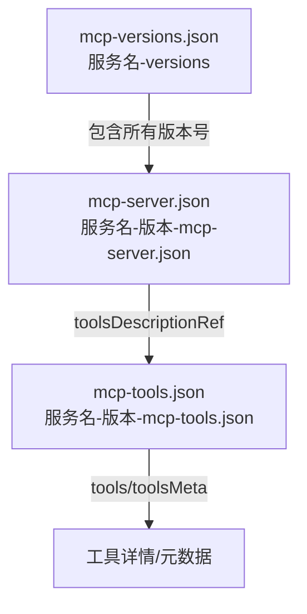

# Nacos dataId 结构与关联详细分析

## 1. mcp-server.json（服务主配置）
- dataId: `${服务名}-${版本号}-mcp-server.json`
- group: mcp-server
- 主要结构（McpServerInfo）：
  - name, version, protocol, description, enabled
  - remoteServerConfig（serviceRef: serviceName, groupName, namespaceId, exportPath）
  - toolsDescriptionRef（指向 mcp-tools.json）
  - promptDescriptionRef, resourceDescriptionRef

## 2. mcp-tools.json（工具配置）
- dataId: `${服务名}-${版本号}-mcp-tools.json`
- group: mcp-tools
- 主要结构（McpToolsInfo/McpToolSpecification）：
  - tools: List<McpSchema.Tool>（name, description, inputSchema...）
  - toolsMeta: Map<String, Object>（如 enabled, labels, tags, region...）

## 3. mcp-versions.json（版本索引）
- dataId: `${服务名}-mcp-versions.json`
- group: mcp-server-versions
- 主要结构：
  - name: 服务名
  - versions: List<String>（所有已注册版本号）

## 4. 关联关系与注册/发现流程
- 注册时：
  1. 写入 mcp-server.json（主配置，含 toolsDescriptionRef）
  2. 写入 mcp-tools.json（工具配置，含 tools/toolsMeta）
  3. 更新 mcp-versions.json（版本索引）
- 服务发现：
  1. 查 mcp-server.json 获取主信息和 toolsDescriptionRef
  2. 查 mcp-tools.json 获取工具详情
  3. 查 mcp-versions.json 获取所有版本

## 5. 结构化示意图


## 6. 关键代码片段
```java
// 发布 server 配置
configService.publishConfig(
    serverName + "-" + version + "-mcp-server.json", "mcp-server", JsonUtils.serialize(mcpServerInfo));
// 发布 tools 配置
configService.publishConfig(
    serverName + "-" + version + "-mcp-tools.json", "mcp-tools", JsonUtils.serialize(mcpToolsInfo));
// 更新 versions 配置
configService.publishConfig(
    serverName + "-mcp-versions.json", "mcp-server-versions", JsonUtils.serialize(mcpServerVersions));
```

## 7. 总结
- mcp-server.json 通过 toolsDescriptionRef 关联 mcp-tools.json
- mcp-versions.json 维护所有版本号索引
- 三者协同实现注册、发现、工具能力、版本管理的全链路一致性 

---------------------------------------------------------------------
下面详细分析 spring-ai-alibaba-mcp 官方 nacos 侧三类配置（mcp-server.json、mcp-tools.json、mcp-versions.json）的**内部结构**及**关联关系**，并结合源码说明它们如何协同工作。

---

## 1. mcp-server.json（服务主配置）

**dataId**：`${服务名}-${版本号}-mcp-server.json`  
**group**：`mcp-server`

### 主要结构（以 McpServerInfo 为例）：
```java
public class McpServerInfo {
    private String protocol;                // 协议类型（如 mcp-sse、local）
    private String name;                    // 服务名（通常带版本号）
    private String description;             // 服务描述
    private String version;                 // 版本号
    private Boolean enabled;                // 是否启用
    private RemoteServerConfigInfo remoteServerConfig; // 远程服务配置
    private Map<Object, Object> localServerConfig;     // 本地服务配置
    private String toolsDescriptionRef;     // 工具描述引用（指向 mcp-tools.json 的 dataId）
    private String promptDescriptionRef;    // 其它描述引用
    private String resourceDescriptionRef;  // 其它描述引用
    // ... getter/setter
}
```
**核心字段说明**：
- `name`、`version`：唯一标识服务实例
- `remoteServerConfig`：包含 serviceRef（serviceName、groupName、namespaceId）、exportPath 等
- `toolsDescriptionRef`：指向本服务的工具配置 dataId（即 mcp-tools.json）

---

## 2. mcp-tools.json（工具配置）

**dataId**：`${服务名}-${版本号}-mcp-tools.json`  
**group**：`mcp-tools`

### 主要结构（以 McpToolsInfo/McpToolSpecification 为例）：
```java
public class McpToolsInfo {
    private List<McpSchema.Tool> tools;     // 工具列表
    private Map<String, Object> toolsMeta;  // 工具元数据（如启用状态、标签等）
    // ... getter/setter
}
```
**McpSchema.Tool** 结构（简化）：
```java
public class Tool {
    private String name;                    // 工具名
    private String description;             // 工具描述
    private Map<String, Object> inputSchema;// 输入参数 schema
    // ... 其它字段
}
```
**toolsMeta** 结构示例：
```json
{
  "toolA": { "enabled": true, "labels": ["tag1"] },
  "toolB": { "enabled": false }
}
```

---

## 3. mcp-versions.json（版本索引）

**dataId**：`${服务名}-mcp-versions.json`  
**group**：`mcp-server-versions`（或类似）

### 主要结构（以 McpServerVersions 为例）：
```java
public class McpServerVersions {
    private String name;                    // 服务名
    private List<String> versions;          // 已注册的所有版本号
    // ... getter/setter
}
```
**作用**：  
- 记录该服务所有已注册的版本，便于发现和管理。

---

## 4. 关联关系与协同机制

### 1）注册流程
- 注册服务时，先写入 mcp-server.json，描述服务主信息。
- 再写入 mcp-tools.json，描述该服务下所有工具。
- mcp-server.json 的 `toolsDescriptionRef` 字段指向 mcp-tools.json 的 dataId。
- mcp-versions.json 维护所有版本号索引。

### 2）服务发现与工具发现
- 查询服务时，先查 mcp-server.json，获取主配置信息和 toolsDescriptionRef。
- 再根据 toolsDescriptionRef 查 mcp-tools.json，获取工具详情和元数据。
- 版本管理通过 mcp-versions.json 实现。

### 3）元数据与扩展
- mcp-tools.json 的 toolsMeta 支持扩展（如 labels、env、capabilities、tags、gray、region 等），可灵活透传。
- mcp-server.json 可通过 promptDescriptionRef、resourceDescriptionRef 等扩展更多描述。

---

## 5. 结构化示意图


---

## 6. 代码片段举例

**注册时写入配置：**
```java
// 1. 写入 mcp-server.json
configService.publishConfig(
    serverName + "-" + version + "-mcp-server.json", "mcp-server", JsonUtils.serialize(mcpServerInfo));

// 2. 写入 mcp-tools.json
configService.publishConfig(
    serverName + "-" + version + "-mcp-tools.json", "mcp-tools", JsonUtils.serialize(mcpToolsInfo));

// 3. 更新 mcp-versions.json
configService.publishConfig(
    serverName + "-mcp-versions.json", "mcp-server-versions", JsonUtils.serialize(mcpServerVersions));
```

---

## 7. 总结

- **mcp-server.json**：服务主配置，包含 toolsDescriptionRef 指向工具配置
- **mcp-tools.json**：工具详情和元数据，支持灵活扩展
- **mcp-versions.json**：服务所有版本号索引
- 三者通过服务名、版本号、toolsDescriptionRef 等字段形成强关联，保证注册、发现、工具能力、版本管理的全链路一致性

如需具体字段对比、序列化样例或某一结构的详细说明，请继续告知！