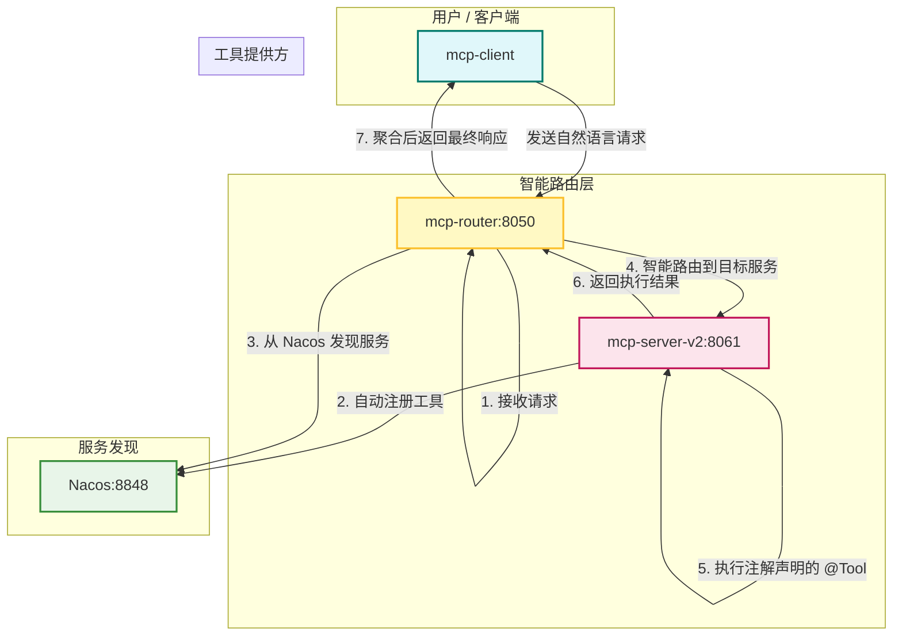

### 项目现状分析总结

经过对项目的全面审查，我发现当前实现已经从过去的手动配置演进为更加自动化、基于注解的现代架构，这主要得益于 Spring AI Starter 的强大功能。您提供的 `TODO08.md` 在核心理念上是正确的，但具体的实现细节已经过时。

以下是当前项目的核心逻辑：

1.  **`mcp-server-v2` (工具提供方):**
    *   **核心依赖**: 项目利用 `spring-ai-starter-mcp-server-webflux` 来提供 MCP（模型上下文协议）的核心服务能力。
    *   **工具定义**: 过去在 `application.yml` 中定义工具的方式已被废弃。现在，工具是通过在 `@Component` 类的方法上使用 `@Tool` 和 `@ToolParam` 注解来声明的。Spring AI 会自动扫描并发现这些注解，将其注册为可用的工具。
    *   **自动注册**: `mcp-server-v2` 在 `application.yml` 中配置了自身的服务名称 (`person-service-v2`) 以及 `mcp-router` 的地址。启动后，它会自动将自身以及所有通过注解发现的工具注册到 `mcp-router`。
    *   **冗余代码**: `ToolController.java` 现在很可能是一个冗余的组件，因为工具的调用已经由 Spring AI Starter 提供的 `/mcp` 端点统一处理。

2.  **`mcp-router` (智能路由中心):**
    *   **核心角色**: 作为整个系统的唯一入口，负责接收来自客户端的所有请求。
    *   **服务发现**: 它连接到 Nacos (`localhost:8848`)，动态发现所有注册上来的 `mcp-server` 实例。
    *   **智能路由**: `mcp-router` 的 `application.yml` 中配置了 DeepSeek AI 模型。这赋予了它理解自然语言提示（Prompt）的能力，并能智能地将请求路由到后端最合适的 `mcp-server` 上的具体工具。它不再是一个简单的反向代理，而是一个智能调度中枢。

3.  **`mcp-client` (服务消费方):**
    *   **交互方式**: 客户端仅与 `mcp-router` 通信，完全无需关心后端的服务实例具体在哪里。
    *   **调用流程**: 客户端向 `mcp-router` 发送高层级的自然语言请求。`mcp-router` 解析该请求，并编排一个或多个后端工具来完成任务，最后将结果返回给客户端。

这个架构形成了一个现代化、可扩展、高内聚的“模型即服务”(Model-as-a-Service)体系。

### 架构流程图

下图清晰地展示了当前系统的交互流程：

