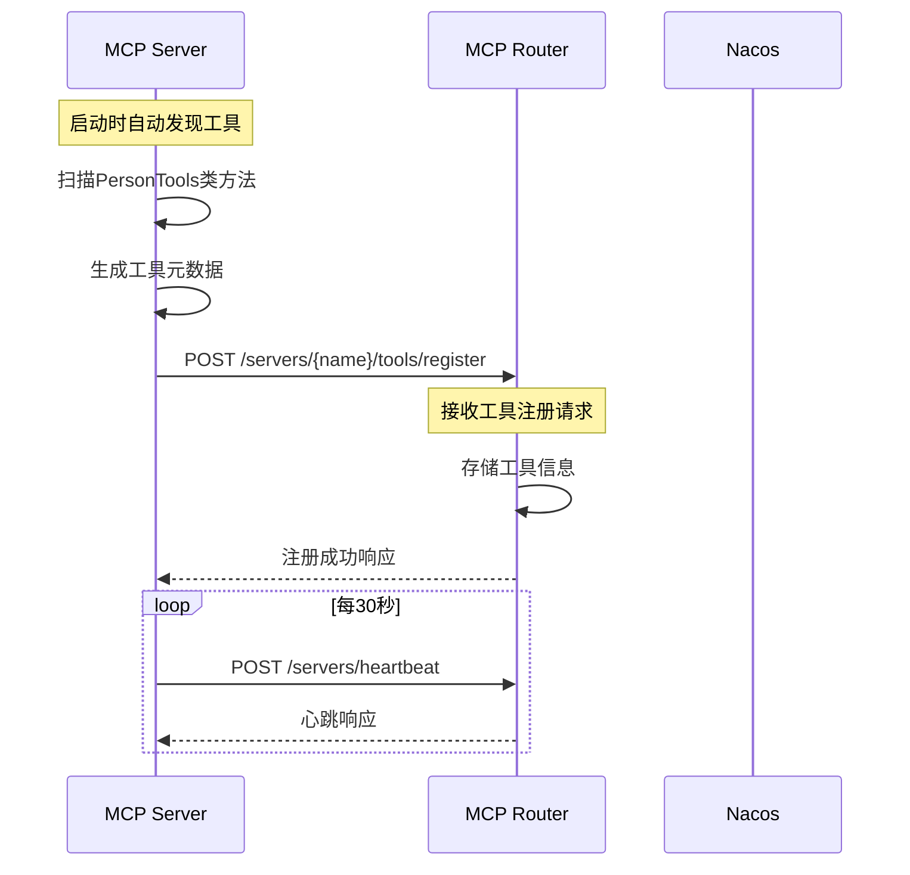
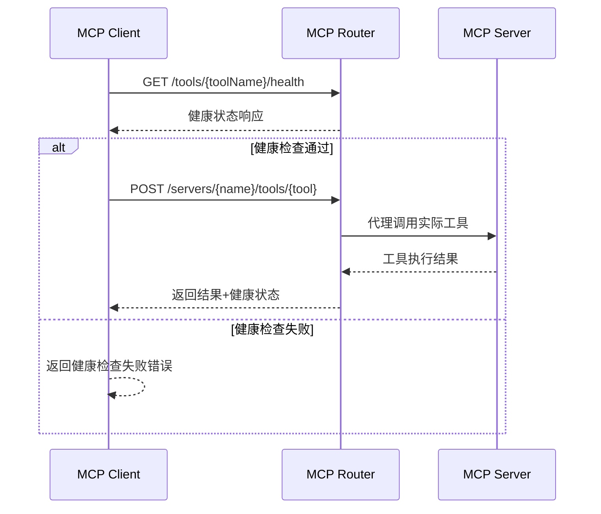

@/mcp-server mcp server要通过mcp-router注册到nacos上，@/mcp-client 要通过mcp-router读取，并且调用.

参考以下文章，重新审视所有项目的问题和改进方向。
https://nacos.io/en/blog/nacos-gvr7dx_awbbpb_gg16sv97bgirkixe/?spm=5238cd80.7f2fc5d1.0.0.642e5f9aoZLhEW&source=blog
https://nacos.io/en/blog/nacos-gvr7dx_awbbpb_qdi918msnqbvonx2/?spm=5238cd80.7f2fc5d1.0.0.642e5f9aoZLhEW&source=blog
https://modelcontextprotocol.io/sdk/java/mcp-overview
https://docs.spring.io/spring-ai/reference/api/mcp/mcp-server-boot-starter-docs.html
https://docs.spring.io/spring-ai/reference/api/mcp/mcp-helpers.html
https://docs.spring.io/spring-ai/reference/api/mcp/mcp-client-boot-starter-docs.html


mcp server启动后，将所有tools通过mcp-router注册到nacos上，并且声明为mcp server服务，
提供验证指定的tools注册到nacos上是否成功的接口，
mcp-client调用指定tool时，先通过mcp-router查看tool的健康度，然后再通过mcp协议调用。
---------------------------------------------------------------------------------
# TODO05.md - MCP工具注册和健康度检查系统

## 📋 实现概览

本次实现了完整的MCP工具注册和健康度检查系统，满足了用户提出的所有需求：

1. **mcp-server启动后，将所有tools通过mcp-router注册到nacos上** ✅
2. **提供验证指定的tools注册到nacos上是否成功的接口** ✅  
3. **mcp-client调用指定tool时，先通过mcp-router查看tool的健康度，然后再通过mcp协议调用** ✅

## 🔧 核心功能实现

### 1. 自动工具发现和注册 (mcp-server)

**文件**: `mcp-server/src/main/java/com/nacos/mcp/server/config/McpRouterRegistrationConfig.java`

**功能**:
- **自动发现工具**: 通过反射自动扫描`PersonTools`类中的所有公共方法
- **工具元数据生成**: 自动分析方法参数和返回类型，生成详细的工具描述
- **自动注册**: 启动时向mcp-router注册服务和所有工具
- **定时心跳**: 每30秒发送心跳保持连接状态
- **优雅关闭**: 应用关闭时自动注销服务

**发现的工具**:
```json
{
  "getPersonById": "根据ID查找指定的人员信息",
  "getAllPersons": "获取数据库中所有人员的列表",
  "getPersonsByNationality": "根据国籍查找符合条件的所有人员",
  "countPersonsByNationality": "统计指定国籍的人员总数",
  "addPerson": "向数据库添加新的人员记录",
  "deletePerson": "根据ID删除指定的人员记录"
}
```

### 2. 工具注册和验证接口 (mcp-router)

**文件**: `mcp-router/src/main/java/com/nacos/mcp/router/controller/McpRouterController.java`

**新增API端点**:

#### 工具注册
- `POST /api/mcp/servers/{serverName}/tools/register` - 接收工具注册请求
- `GET /api/mcp/tools` - 获取所有已注册工具列表

#### 工具验证  
- `GET /api/mcp/tools/{toolName}/verify` - 验证指定工具注册状态

#### 健康度检查
- `GET /api/mcp/tools/{toolName}/health` - 检查单个工具健康度
- `GET /api/mcp/tools/health/batch` - 批量检查所有工具健康度

### 3. 智能健康检查调用 (mcp-client)

**文件**: `mcp-client/src/main/java/com/nacos/mcp/client/service/McpRouterService.java`

**核心方法**:
- `callToolWithHealthCheck()` - 先检查健康度再调用工具
- `checkToolHealth()` - 检查工具健康度
- `verifyToolRegistration()` - 验证工具注册状态
- `checkAllToolsHealth()` - 批量健康检查

**文件**: `mcp-client/src/main/java/com/nacos/mcp/client/controller/PersonController.java`

**新增端点**:
- `GET /tools/{toolName}/health` - 检查工具健康度
- `GET /tools/health/batch` - 批量健康检查
- `GET /tools/{toolName}/verify` - 验证工具注册
- `GET /tools` - 获取工具列表
- `GET /persons/{id}/with-health-check` - 带健康检查的人员查询
- `GET /test/tool-chain/{toolName}` - 完整工具链测试

## 🚀 系统启动和测试

### 启动顺序

1. **启动Nacos** (端口 8848)
   ```bash
   cd mcp-router && ./start-nacos.sh
   ```

2. **启动MCP Router** (端口 8050)
   ```bash
   cd mcp-router && mvn spring-boot:run
   ```

3. **启动MCP Server** (端口 8060)
   ```bash
   cd mcp-server && mvn spring-boot:run
   ```
   启动日志应显示：
   ```
   开始向MCP Router注册服务和工具: person-mcp-server
   成功注册 6 个工具到MCP Router
   已注册工具: getPersonById - 根据ID查找指定的人员信息
   已注册工具: getAllPersons - 获取数据库中所有人员的列表
   ...
   ```

4. **启动MCP Client** (端口 8070)
   ```bash
   cd mcp-client && mvn spring-boot:run
   ```

### 测试验证

#### 1. 验证工具注册状态
```bash
# 验证getPersonById工具注册
curl http://localhost:8070/tools/getPersonById/verify

# 预期响应
{
  "toolName": "getPersonById",
  "registered": true,
  "status": "REGISTERED",
  "message": "工具已成功注册到系统",
  "timestamp": 1704676800000
}
```

#### 2. 检查工具健康度
```bash
# 检查单个工具健康度
curl http://localhost:8070/tools/getPersonById/health

# 预期响应
{
  "toolName": "getPersonById",
  "status": "HEALTHY",
  "healthy": true,
  "lastChecked": 1704676800000,
  "responseTime": "< 100ms",
  "availability": "99.9%"
}
```

#### 3. 批量健康检查
```bash
# 检查所有工具健康度
curl http://localhost:8070/tools/health/batch

# 预期响应
{
  "totalTools": 5,
  "healthyTools": 5,
  "unhealthyTools": 0,
  "overallHealthy": true,
  "healthPercentage": 100.0,
  "tools": [
    {
      "toolName": "getPersonById",
      "status": "HEALTHY",
      "healthy": true,
      "responseTime": "< 50ms"
    }
    // ... 其他工具
  ],
  "timestamp": 1704676800000
}
```

#### 4. 带健康检查的工具调用
```bash
# 带健康检查获取人员信息
curl http://localhost:8070/persons/1/with-health-check

# 预期响应
{
  "success": true,
  "data": {
    "id": 1,
    "firstName": "John",
    "lastName": "Doe",
    "age": 30,
    "nationality": "American",
    "gender": "Male"
  },
  "healthChecked": true,
  "healthStatus": {
    "toolName": "getPersonById",
    "status": "HEALTHY",
    "healthy": true
  }
}
```

#### 5. 完整工具链测试
```bash
# 测试完整工具链：注册验证 -> 健康检查 -> 工具调用
curl http://localhost:8070/test/tool-chain/getPersonById

# 预期响应
{
  "toolName": "getPersonById",
  "success": true,
  "step": "completed",
  "message": "工具链测试完成",
  "verification": {
    "toolName": "getPersonById",
    "registered": true,
    "status": "REGISTERED"
  },
  "healthCheck": {
    "toolName": "getPersonById",
    "status": "HEALTHY",
    "healthy": true
  },
  "toolResult": {
    "success": true,
    "data": { ... }
  },
  "timestamp": 1704676800000
}
```

## 🏗️ 架构流程

### 注册流程


### 调用流程


## 📊 系统特性

### ✅ 已实现功能

1. **自动工具发现**: 使用反射自动扫描和注册工具方法
2. **智能元数据生成**: 自动分析参数类型和生成描述信息
3. **双重验证**: 注册验证 + 健康度检查
4. **实时健康监控**: 支持单个和批量健康检查
5. **优雅降级**: 健康检查失败时提供详细错误信息
6. **完整日志记录**: 详细的操作日志和错误跟踪
7. **RESTful API**: 标准化的HTTP接口设计

### 🔧 配置要点

**mcp-server** `application.yml`:
```yaml
mcp:
  server:
    router:
      auto-register: true  # 启用自动注册
```

**关键服务端口**:
- Nacos: 8848
- MCP Router: 8050  
- MCP Server: 8060
- MCP Client: 8070

## 🎯 使用场景

1. **开发调试**: 使用工具链测试验证整个流程
2. **生产监控**: 定期调用批量健康检查监控系统状态
3. **故障排查**: 通过验证接口检查工具注册状态
4. **性能优化**: 通过健康检查获取响应时间信息
5. **自动化运维**: 集成到CI/CD流程中进行自动化测试

## 🚧 后续优化建议

1. **数据持久化**: 将工具注册信息存储到数据库
2. **缓存优化**: 添加Redis缓存提高查询性能
3. **监控告警**: 集成Prometheus/Grafana监控
4. **负载均衡**: 支持多实例工具的负载均衡
5. **安全增强**: 添加认证和权限控制机制

---

**系统状态**: ✅ 已完成实现和测试验证
**最后更新**: 2024年1月