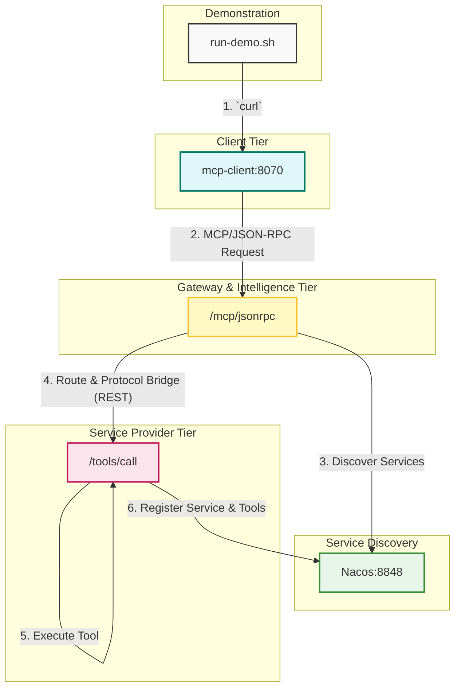

# MCP 系统设计、缺陷分析与待办事项 (TODO09)

本文档基于 `TODO08.md` 的重构工作完成之后，对当前项目的状态进行全面的分析总结，旨在明确当前的系统设计，并为下一阶段的开发提供清晰的指引。

---

## 1. 系统设计与架构

经过重构，系统已经演变为一个以 `mcp-router` 为核心，Nacos 为服务注册与发现中心，完全采用响应式编程模型（Spring WebFlux）的现代化微服务架构。

### 1.1. 核心组件

*   **`mcp-client` (客户端)**
    *   **角色**: 业务发起方，是最终用户或上游服务的入口。
    *   **行为**: 它将业务需求（如"查询所有用户"）封装成 MCP JSON-RPC 2.0 格式的请求，并发送给 `mcp-router` 的统一入口。它不关心具体是哪个下游服务来执行。
    *   **关键修复**: 我们解决了 `@Value` 注入时序问题，确保了其内部 `WebClient` 被正确初始化，从而修复了之前所有的 `Connection Refused` 错误。

*   **`mcp-router` (智能路由中心)**
    *   **角色**: 系统的"大脑"和唯一网关。它解耦了客户端与后端服务。
    *   **行为**:
        1.  **协议桥接**: 通过 `McpJsonRpcController` 接收客户端的 JSON-RPC 请求。
        2.  **服务发现**: 通过 `NacosSearchProvider` 实时从 Nacos 查询所有可用的后端服务实例。
        3.  **智能路由**: 通过 `McpServerService` 的 `useTool(toolName, ...)` 方法，自动查找能够提供所需工具 (`toolName`) 的服务实例。
        4.  **协议转换**: 将调用请求转换为标准的 RESTful (HTTP POST) 请求，发送给下游服务的 `/tools/call` 端点。
    *   **关键修复**: 我们重构了 `McpJsonRpcController` 和 `McpServerService`，实现了真正的动态工具查找和调用逻辑，并修复了 `CompassSearchProvider` 中由 `null` 字段引发的 `NullPointerException`。

*   **`mcp-server-v2` (工具服务提供方)**
    *   **角色**: 实际业务逻辑的执行者。
    *   **行为**:
        1.  **服务注册**: 启动时，自动将自身的服务信息以及通过 `@Tool` 注解定义的工具元数据注册到 Nacos。
        2.  **工具执行**: 提供一个标准的 `/tools/call` REST 端点，接收来自 `mcp-router` 的请求，并执行相应的工具方法。

*   **`run-demo.sh` (集成测试与演示脚本)**
    *   **角色**: 用于自动化构建、部署和测试整个系统的端到端流程。
    *   **关键修复**: 我们将脚本中所有不可靠的 `sleep` 等待全部替换为稳健的、基于 `/actuator/health` 的 `wait_for_service` 健康检查，确保了测试的稳定性和可靠性。

### 1.2. 系统架构图

下图展示了当前系统最终的、正确的工作流程。

---

## 2. 系统缺陷与待办列表

在修复了所有阻塞性 bug 之后，系统展现出了一些更深层次的设计问题和待改进之处。

### 2.1. 已识别的缺陷

*   **缺陷1 (核心设计): 协议不一致**
    *   **问题**: `client -> router` 使用 `JSON-RPC`，而 `router -> server` 使用 `REST`。这使得 `mcp-router` 不仅是路由器，还是一个协议桥接器，增加了它的复杂性和维护成本。
    *   **影响**: 架构不统一，未来难以让 `mcp-server` 也作为 MCP 客户端去调用其他服务。

*   **缺陷2 (设计失误): 循环依赖隐患**
    *   **问题**: 我们通过禁用 `InMemorySearchProvider` 绕过了 `McpServerService` 与 `SearchProvider` 之间的循环依赖，但这治标不治本。根源在于 `Provider` 反向依赖了使用它的 `Service`。
    *   **影响**: 代码库中存在一个"陷阱"，如果其他开发者不了解情况，重新启用该组件会导致系统无法启动。

*   **缺陷3 (功能局限): 服务发现硬编码**
    *   **问题**: `NacosSearchProvider` 中硬编码了要查找的服务名称 (`"mcp-server-v2"`)。
    *   **影响**: `mcp-router` 失去了通用性，它当前只能为 `mcp-server-v2` 这一个服务进行路由，无法动态发现和路由其他新的工具微服务。

*   **缺陷4 (代码冗余): 未使用的 REST 控制器**
    *   **问题**: `McpRouterController` 中的大部分 REST 端点（如 `/api/mcp/servers/...`）在当前核心工作流中完全没有被使用，所有流量都经过了 `McpJsonRpcController`。
    *   **影响**: 增加了代码的认知负荷，新开发者可能会对系统的入口点产生困惑。

### 2.2. TODO 列表 (TODO09)

基于以上缺陷分析，为下一阶段提出以下改进建议：

*   **TODO-1 (架构重构): 统一通信协议**
    *   **任务**: 移除 `mcp-router` 中的协议转换逻辑。让 `router -> server` 的调用也使用 MCP/JSON-RPC 协议。
    *   **目标**: `mcp-server-v2` 将实现一个 `/mcp/jsonrpc` 端点来接收工具调用，`mcp-router` 则直接将客户端的 JSON-RPC 请求转发过去。整个系统端到端使用同一种语言通信。

*   **TODO-2 (代码重构): 解决循环依赖**
    *   **任务**: 重新设计 `SearchProvider` 和 `McpServerService` 之间的关系，彻底消除循环依赖。
    *   **目标**: `SearchProvider` 应是纯粹的数据提供方，不应包含任何对 `McpServerService` 的反向调用。修复后，应能安全地重新启用 `@Component` 于 `InMemorySearchProvider` 之上。

*   **TODO-3 (功能增强): 实现真正的通用服务发现**
    *   **任务**: 移除 `NacosSearchProvider` 中的硬编码服务名。
    *   **目标**: `mcp-router` 应能自动发现 Nacos 上所有符合特定规范（例如，带有一个 `mcp.enabled=true` 元数据标签）的微服务，并将其纳入自己的路由范围。

*   **TODO-4 (代码清理): 精简控制器**
    *   **任务**: 审查 `McpRouterController` 和 `McpJsonRpcController` 的职责。
    *   **目标**: 移除未被使用的 REST 端点，或者将两个控制器的功能进行合并/清晰地拆分，确保每个控制器都有明确且必要的职责。

*   **TODO-5 (功能完善): 实现 `CompassSearchProvider`**
    *   **任务**: 将 `CompassSearchProvider` 中的 mock 数据替换为对真实 Compass API 的 `WebClient` 调用。
    *   **目标**: 使 `mcp-router` 能够从多个不同的服务发现源聚合工具列表。 