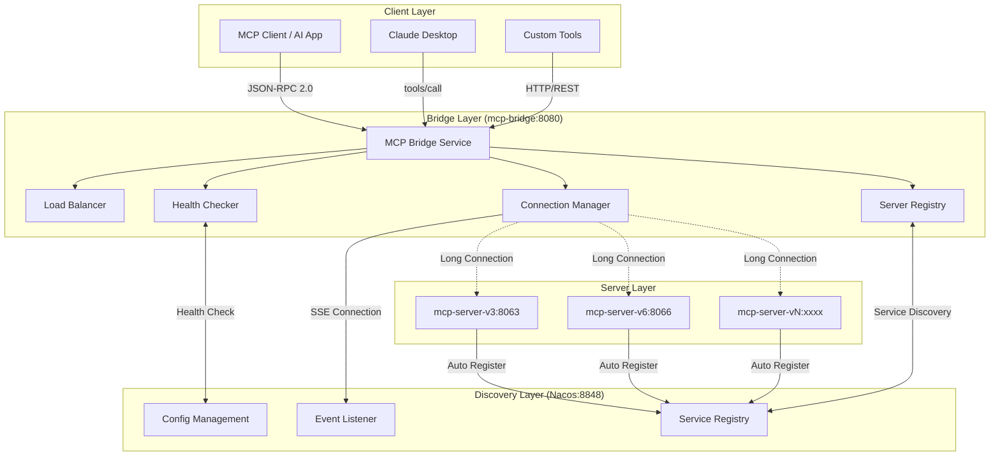

# MCP Bridge 文档大纲

## 📋 文档概述

本大纲为 mcp-bridge 项目设计，旨在帮助新接触的开发者快速理解项目的核心概念、原理、使用方法和可完成的任务。

---

## 📖 一、项目简介与背景

### 1.1 什么是 MCP Bridge？
- **定义**: 基于 Model Context Protocol (MCP) 的智能桥接网关
- **核心价值**: 作为客户端与 MCP 服务器之间的桥梁，提供统一的服务发现和负载均衡
- **技术背景**: 
  - Spring AI Alibaba 框架生态的重要组件
  - 符合 MCP 标准协议规范 (JSON-RPC 2.0)
  - 基于事件驱动的现代化微服务架构

### 1.2 项目在整体生态中的位置
- **上游**: AI 应用、MCP 客户端、Claude Desktop 等
- **下游**: 各种 MCP 服务器实例 (mcp-server-v3、mcp-server-v6 等)
- **中台**: Nacos 服务注册发现中心
- **框架**: Spring AI Alibaba MCP 自动配置体系

### 1.3 解决的核心问题
- **服务发现难题**: 自动发现和管理分布式 MCP 服务
- **负载均衡需求**: 智能分配请求到最优服务实例
- **连接管理复杂性**: 统一管理 SSE 长连接和连接池
- **协议标准化**: 提供符合 MCP 标准的统一接口

---

## 🏗️ 二、核心架构与设计原理

### 2.1 整体架构设计

#### 架构演进历程
- **第一代**: 简单的 HTTP 代理模式
- **第二代**: 基于 Nacos 的服务注册发现
- **第三代** (当前): 事件驱动 + 智能路由 + 连接池管理

#### 核心架构图


### 2.2 核心设计原理

#### 2.2.1 事件驱动架构
**从"推模式"到"拉模式"的革命性转变**:

**传统推模式问题**:
- Bridge 主动轮询服务器状态 (30秒一次)
- 资源浪费，实时性差
- 连接状态感知滞后

**新拉模式优势**:
- MCP Server 主动连接 Bridge
- 实时事件通知机制
- 零延迟的状态变更感知

#### 2.2.2 智能桥接策略
**多维度桥接决策**:
1. **服务发现**: 基于 Nacos 的实时服务列表
2. **健康检查**: 动态过滤不健康实例
3. **负载均衡**: 加权轮询算法
4. **工具匹配**: 按需查找能提供特定工具的服务

#### 2.2.3 连接池管理
**高效连接复用**:
- SSE 长连接复用
- 连接池动态扩缩容
- 故障连接自动回收
- 连接健康状态监控

### 2.3 关键技术组件

#### 2.3.1 McpRouterService (核心桥接引擎)
```java
// 按需桥接：发现 -> 健康检查 -> 负载均衡 -> 连接 -> 调用
public Mono<McpMessage> routeRequest(String serviceName, McpMessage message, Duration timeout)
```

#### 2.3.2 McpClientManager (连接管理器)
- 维护服务实例的 MCP 客户端连接
- 实现连接池和故障转移
- 提供连接健康监控

#### 2.3.3 LoadBalancer (负载均衡器)
- 加权轮询算法
- 实例权重动态调整
- 故障实例自动剔除

---

## 🚀 三、核心功能特性

### 3.1 智能服务发现
- **自动注册**: MCP 服务器启动时自动注册到 Nacos
- **实时发现**: Bridge 实时感知服务上下线
- **元数据管理**: 服务能力、工具清单、版本信息
- **命名空间隔离**: 支持多环境部署

### 3.2 高可用负载均衡
- **算法支持**: 加权轮询、随机、最少连接
- **健康检查**: 定时健康探测 + 被动故障检测
- **故障转移**: 自动切换到健康实例
- **性能监控**: 响应时间、错误率统计

### 3.3 协议标准化支持
- **MCP Protocol**: 完全符合 Model Context Protocol 规范
- **JSON-RPC 2.0**: 标准的远程调用协议
- **SSE Transport**: Server-Sent Events 长连接传输
- **工具调用**: tools/call 方法的完整实现

### 3.4 企业级特性
- **配置管理**: 集中化配置 + 热更新
- **监控指标**: 详细的性能和业务指标
- **安全认证**: 支持 Nacos 安全认证
- **日志审计**: 完整的调用链路日志

---

## 📚 四、使用指南与最佳实践

### 4.1 基础使用

#### 4.1.1 工具调用示例
```bash
# 调用特定服务的工具
curl -X POST http://localhost:8080/mcp/bridge/route/mcp-server-v6 \
  -H "Content-Type: application/json" \
  -d '{
    "id": "req-001",
    "method": "tools/call",
    "params": {
      "name": "getPersonById",
      "arguments": {
        "id": 1
      }
    }
  }'
```

#### 4.1.2 服务状态查询
```bash
# 查看所有注册的服务
curl http://localhost:8080/mcp/bridge/services

# 查看桥接统计信息
curl http://localhost:8080/mcp/bridge/stats

# 健康检查
curl http://localhost:8080/actuator/health
```

### 4.2 集成开发

#### 4.2.1 Java Client 集成
```java
@Component
public class McpBridgeClient {
    
    @Autowired
    private WebClient webClient;
    
    public Mono<String> callTool(String toolName, Map<String, Object> args) {
        return webClient.post()
            .uri("/mcp/smart/call")
            .bodyValue(Map.of("toolName", toolName, "arguments", args))
            .retrieve()
            .bodyToMono(String.class);
    }
}
```

#### 4.2.2 Spring AI 集成
```java
@Configuration
public class McpBridgeConfiguration {
    
    @Bean
    public Function<String, String> mcpToolFunction() {
        return toolName -> {
            // 通过 Bridge 调用工具
            return mcpBridgeClient.callTool(toolName, Collections.emptyMap()).block();
        };
    }
}
```

### 4.3 最佳实践

#### 4.3.1 服务注册最佳实践
- **命名规范**: 使用清晰的服务命名 (如: user-service-v1)
- **版本管理**: 采用语义化版本号
- **健康检查**: 实现自定义健康检查端点
- **优雅下线**: 正确处理服务停机

#### 4.3.2 性能优化建议
- **连接池配置**: 根据并发量调整连接池大小
- **超时设置**: 合理设置各种超时时间
- **缓存策略**: 对频繁查询的结果进行缓存
- **监控告警**: 建立完善的监控体系

#### 4.3.3 安全性考虑
- **认证授权**: 启用 Nacos 安全认证
- **网络隔离**: 使用防火墙限制访问
- **日志脱敏**: 避免敏感信息泄露
- **HTTPS**: 生产环境使用 HTTPS

---

## 🚨 五、常见问题与故障排除

### 5.1 部署相关问题

#### Q1: Nacos 连接失败
**错误信息**: `Connection refused to nacos server`
**解决方案**:
1. 检查 Nacos 服务是否启动
2. 验证网络连通性
3. 确认端口配置正确
4. 检查防火墙设置

#### Q2: 服务注册失败
**错误信息**: `Failed to register service to nacos`
**解决方案**:
1. 检查 Nacos 认证信息
2. 验证命名空间配置
3. 确认服务名称格式
4. 查看 Nacos 服务端日志

### 5.2 运行时问题

#### Q3: 负载均衡不生效
**现象**: 请求总是路由到同一个服务实例
**排查步骤**:
1. 检查服务实例权重配置
2. 验证健康检查状态
3. 查看负载均衡算法配置
4. 监控请求分布情况

#### Q4: 工具调用超时
**现象**: 工具调用经常超时
**解决方案**:
1. 增加超时时间配置
2. 优化目标服务性能
3. 检查网络延迟
4. 启用连接池复用

### 5.3 性能问题

#### Q5: 内存使用过高
**排查方法**:
1. 生成内存快照分析
2. 检查连接池泄漏
3. 监控 GC 频率
4. 调整 JVM 参数

#### Q6: 响应时间慢
**优化建议**:
1. 启用结果缓存
2. 优化数据库查询
3. 增加服务实例
4. 使用异步处理

---


## 🔗 六、参考资料与扩展阅读

### 6.1 官方文档
- [Model Context Protocol 规范](https://modelcontextprotocol.io/docs/)
- [Spring AI Alibaba 文档](https://github.com/alibaba/spring-ai-alibaba)
- [Nacos 官方文档](https://nacos.io/docs/latest/)

### 6.2 相关项目
- [mcp-server-v3](../mcp-server-v3/): MCP 服务器参考实现
- [mcp-server-v6](../mcp-server-v6/): 增强版 MCP 服务器
- [spring-ai-alibaba](../spring-ai-alibaba/): Spring AI Alibaba 框架

### 6.3 技术博客
- [MCP 协议深度解析](./MCP_PROTOCOL_ANALYSIS.md)
- [Spring AI 集成最佳实践](./SPRING_AI_BEST_PRACTICES.md)
- [微服务架构下的 MCP 应用](./MICROSERVICE_MCP_ARCHITECTURE.md)

---

### 后续完善计划
1. **详细教程**: 基于此大纲编写详细的使用教程
2. **API 文档**: 补充完整的 API 接口文档
3. **示例代码**: 提供更多实际使用示例
4. **性能测试**: 添加性能测试报告和调优指南
5. **安全指南**: 补充详细的安全配置指南

---
