# MCP 项目架构图

## 概述

本文档描述了 MCP (Model Context Protocol) 项目的整体架构，包括 mcp-router-v3、mcp-server-v3、mcp-server-v6 以及 Spring AI Alibaba 框架的集成关系。

## 整体架构图

```mermaid
graph TB
    subgraph "Client Layer"
        C1[MCP Client 1]
        C2[MCP Client 2]
        C3[AI Application]
    end
    
    subgraph "Router Layer (mcp-router-v3)"
        MR[MCP Router Service<br/>Port: 8080]
        LB[Load Balancer<br/>Weighted Round Robin]
        HC[Health Check Service]
        CM[Client Manager<br/>Connection Pool]
        SR[Server Registry<br/>Nacos Discovery]
    end
    
    subgraph "Service Registry (Nacos)"
        NS[Nacos Server<br/>Port: 8848]
        NSR[Service Registry]
        NCF[Config Management]
    end
    
    subgraph "MCP Server Layer"
        subgraph "mcp-server-v3"
            MS3[MCP Server v3<br/>Port: 8063]
            PT3[PersonManagement Tool]
            SSE3[SSE Endpoint: /sse]
            MSG3[Message Endpoint: /mcp/message]
        end
        
        subgraph "mcp-server-v6"
            MS6[MCP Server v6<br/>Port: 8066]
            PT6[PersonManagement Tool]
            SSE6[SSE Endpoint: /sse]
            MSG6[Message Endpoint: /mcp/message]
        end
    end
    
    subgraph "Spring AI Alibaba Framework"
        subgraph "Auto Configuration"
            NMAC[NacosMcpAutoConfiguration]
            NMSAC[NacosMcpServerAutoConfiguration]
            NMCAC[NacosMcpClientAutoConfiguration]
        end
        
        subgraph "Core Components"
            NMR[NacosMcpRegister]
            NMO[NacosMcpOperationService]
            NMP[NacosMcpProperties]
        end
    end
    
    %% Client to Router connections
    C1 -->|HTTP/REST API| MR
    C2 -->|HTTP/REST API| MR
    C3 -->|HTTP/REST API| MR
    
    %% Router internal connections
    MR --> LB
    MR --> HC
    MR --> CM
    MR --> SR
    
    %% Router to Nacos
    SR -->|Service Discovery| NS
    HC -->|Health Check| NS
    
    %% Router to Servers
    CM -.->|SSE Connection| SSE3
    CM -.->|SSE Connection| SSE6
    CM -->|Tool Call| MSG3
    CM -->|Tool Call| MSG6
    
    %% Servers to Nacos registration
    MS3 -->|Register Service| NSR
    MS6 -->|Register Service| NSR
    
    %% Spring AI Alibaba integration
    NMAC --> NMO
    NMSAC --> NMR
    NMR --> NSR
    NMO --> NCF
    
    %% Server internal structure
    MS3 --> PT3
    MS3 --> SSE3
    MS3 --> MSG3
    
    MS6 --> PT6
    MS6 --> SSE6
    MS6 --> MSG6
    
    %% Protocol annotations
    MR -.->|"tools/call<br/>JSON-RPC 2.0"| CM
    CM -.->|"MCP Protocol<br/>SSE Transport"| SSE3
    CM -.->|"MCP Protocol<br/>SSE Transport"| SSE6
    
    classDef router fill:#e1f5fe,stroke:#0277bd,stroke-width:2px
    classDef server fill:#f3e5f5,stroke:#7b1fa2,stroke-width:2px
    classDef nacos fill:#fff3e0,stroke:#ef6c00,stroke-width:2px
    classDef client fill:#e8f5e8,stroke:#2e7d32,stroke-width:2px
    classDef framework fill:#fce4ec,stroke:#c2185b,stroke-width:2px
    
    class MR,LB,HC,CM,SR router
    class MS3,MS6,PT3,PT6,SSE3,SSE6,MSG3,MSG6 server
    class NS,NSR,NCF nacos
    class C1,C2,C3 client
    class NMAC,NMSAC,NMCAC,NMR,NMO,NMP framework
```



## 架构组件说明

### 客户端层 (Client Layer)
- **MCP Client**: 标准 MCP 协议客户端
- **AI Application**: 集成了 MCP 功能的 AI 应用程序
- **通信协议**: HTTP/REST API

### 路由层 (Router Layer) - mcp-router-v3
- **MCP Router Service**: 核心路由服务，端口 8080
- **Load Balancer**: 加权轮询负载均衡器
- **Health Check Service**: 健康检查服务
- **Client Manager**: 连接池管理器
- **Server Registry**: 基于 Nacos 的服务注册发现

### 服务注册中心 (Service Registry)
- **Nacos Server**: 服务注册发现中心，端口 8848
- **Service Registry**: 服务实例注册管理
- **Config Management**: 配置管理服务

### MCP 服务器层 (MCP Server Layer)

#### mcp-server-v3
- **端口**: 8063
- **工具**: PersonManagement Tool
- **端点**: 
  - SSE: `/sse`
  - 消息: `/mcp/message`

#### mcp-server-v6
- **端口**: 8066
- **工具**: PersonManagement Tool
- **端点**: 
  - SSE: `/sse`
  - 消息: `/mcp/message`

### Spring AI Alibaba 框架

#### 自动配置 (Auto Configuration)
- **NacosMcpAutoConfiguration**: Nacos MCP 基础配置
- **NacosMcpServerAutoConfiguration**: MCP 服务器自动配置
- **NacosMcpClientAutoConfiguration**: MCP 客户端自动配置

#### 核心组件 (Core Components)
- **NacosMcpRegister**: 服务注册器
- **NacosMcpOperationService**: Nacos 操作服务
- **NacosMcpProperties**: 配置属性

## 通信协议

### 客户端到路由器
- **协议**: HTTP/REST API
- **格式**: JSON-RPC 2.0
- **方法**: tools/call

### 路由器到服务器
- **协议**: MCP Protocol over SSE
- **传输**: Server-Sent Events
- **连接**: 长连接 + 连接池

### 服务注册
- **协议**: Nacos API
- **方式**: 实例注册 + 配置推送
- **监听**: 配置变化监听

## 关键特性

### 路由器特性
- ✅ 智能路由和服务发现
- ✅ 负载均衡 (加权轮询)
- ✅ 健康检查和故障转移
- ✅ 连接池管理
- ✅ 性能监控

### 服务器特性
- ✅ MCP 协议支持
- ✅ SSE 传输
- ✅ 工具注册和管理
- ✅ Spring AI 集成
- ✅ Nacos 服务注册

### 框架特性
- ✅ 自动配置
- ✅ 服务注册发现
- ✅ 配置管理
- ✅ 负载均衡客户端
- ✅ 工具兼容性检查

## 数据流

### 1. 工具调用流程
```
Client → Router → Load Balancer → Server → Tool → Response
```

### 2. 服务发现流程
```
Server → Nacos Registry → Router Discovery → Connection Pool
```

### 3. 配置更新流程
```
Config Change → Nacos Config → Server Listener → Tool Update
```

## 端口分配

| 组件 | 端口 | 说明 |
|------|------|------|
| mcp-router-v3 | 8080 | 路由服务 |
| mcp-server-v3 | 8063 | MCP 服务器 v3 |
| mcp-server-v6 | 8066 | MCP 服务器 v6 |
| Nacos Server | 8848 | 服务注册中心 |

## 部署建议

### 开发环境
- 单机部署所有组件
- 使用内存存储
- 启用调试日志

### 生产环境
- 路由器集群部署
- 服务器多实例部署
- Nacos 集群部署
- 启用监控和告警

## 扩展性

### 水平扩展
- ✅ 路由器无状态，支持多实例
- ✅ 服务器支持多实例部署
- ✅ 通过 Nacos 自动发现新实例

### 垂直扩展
- ✅ 连接池大小可配置
- ✅ 负载均衡权重可调整
- ✅ 健康检查间隔可配置

## 监控指标

### 路由器指标
- 请求总数和成功率
- 响应时间分布
- 连接池使用情况
- 负载均衡统计

### 服务器指标
- 工具调用次数
- 工具执行时间
- 错误率统计
- 资源使用情况

### 框架指标
- 服务注册状态
- 配置同步状态
- 连接健康状态
- 集群节点状态 