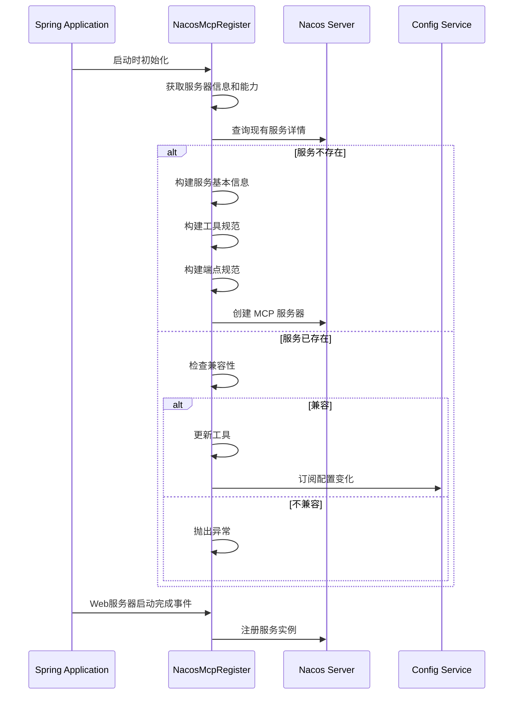
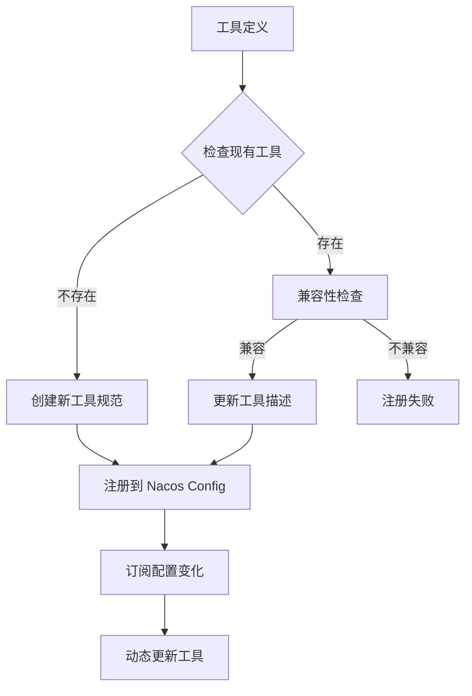

# Spring AI Alibaba Nacos MCP AutoConfig 实现分析

## 概述

Spring AI Alibaba 提供了完整的 MCP (Model Context Protocol) 与 Nacos 集成的自动配置实现，支持服务注册发现、工具管理、配置管理等功能。

## 核心组件架构

### 1. 自动配置类

#### NacosMcpRegistryAutoConfiguration
- **位置**: `spring-ai-alibaba-autoconfigure-nacos-mcp-server`
- **功能**: MCP 服务器注册自动配置
- **关键特性**:
  - 根据传输类型(SSE/STDIO)自动选择注册策略
  - 支持同步和异步 MCP 服务器
  - 条件化配置激活

```java
@Bean
@ConditionalOnBean(McpAsyncServer.class)
@ConditionalOnProperty(prefix = NacosMcpRegistryProperties.CONFIG_PREFIX, 
                      name = "enabled", havingValue = "true")
public NacosMcpRegister nacosMcpRegisterAsync(
    NacosMcpOperationService nacosMcpOperationService,
    McpAsyncServer mcpAsyncServer,
    NacosMcpProperties nacosMcpProperties,
    NacosMcpRegistryProperties nacosMcpRegistryProperties,
    McpServerProperties mcpServerProperties,
    McpServerTransportProvider mcpServerTransport) {
    return getNacosMcpRegister(/*...*/);
}
```

#### NacosMcpClientAutoConfiguration
- **位置**: `spring-ai-alibaba-autoconfigure-nacos-mcp-client`
- **功能**: MCP 客户端自动配置
- **关键特性**:
  - 负载均衡的 MCP 客户端
  - 自动服务发现和连接管理
  - 工具调用代理

### 2. 核心实现类

#### NacosMcpRegister
**主要职责**:
1. **服务注册**: 将 MCP 服务器注册到 Nacos
2. **配置管理**: 管理服务配置和工具规范
3. **兼容性检查**: 确保服务版本和工具兼容性
4. **动态更新**: 监听配置变化并更新工具

**关键方法**:

```java
// 服务初始化和注册
public NacosMcpRegister(NacosMcpOperationService nacosMcpOperationService, 
                       McpAsyncServer mcpAsyncServer,
                       NacosMcpProperties nacosMcpProperties,
                       NacosMcpRegistryProperties nacosMcpRegistryProperties,
                       McpServerProperties mcpServerProperties, 
                       String type) {
    // 1. 获取服务器信息和能力
    this.serverInfo = mcpAsyncServer.getServerInfo();
    this.serverCapabilities = mcpAsyncServer.getServerCapabilities();
    
    // 2. 检查现有服务兼容性
    McpServerDetailInfo serverDetailInfo = 
        nacosMcpOperationService.getServerDetail(serverInfo.name(), serverInfo.version());
    
    // 3. 注册新服务或更新现有服务
    if (serverDetailInfo != null) {
        if (checkCompatible(serverDetailInfo)) {
            updateTools(serverDetailInfo);
        }
    } else {
        // 创建新的 MCP 服务器
        nacosMcpOperationService.createMcpServer(serverInfo.name(), 
                                                serverBasicInfo, 
                                                mcpToolSpec, 
                                                endpointSpec);
    }
}

// Web 服务器启动后的服务实例注册
@Override
public void onApplicationEvent(WebServerInitializedEvent event) {
    int port = event.getWebServer().getPort();
    Instance instance = new Instance();
    instance.setIp(nacosMcpProperties.getIp());
    instance.setPort(port);
    instance.setEphemeral(nacosMcpRegistryProperties.isServiceEphemeral());
    
    nacosMcpOperationService.registerService(getRegisterServiceName(),
                                            nacosMcpRegistryProperties.getServiceGroup(), 
                                            instance);
}
```

**工具兼容性检查**:

```java
private boolean checkToolsCompatible(McpServerDetailInfo serverDetailInfo) {
    McpToolSpecification toolSpec = serverDetailInfo.getToolSpec();
    Map<String, McpTool> toolsInNacos = toolSpec.getTools()
        .stream()
        .collect(Collectors.toMap(McpTool::getName, tool -> tool));
    
    Map<String, McpSchema.Tool> toolsInLocal = this.tools.stream()
        .collect(Collectors.toMap(tool -> tool.tool().name(), 
                                 McpServerFeatures.AsyncToolSpecification::tool));
    
    // 检查工具名称集合是否一致
    if (!toolsInNacos.keySet().equals(toolsInLocal.keySet())) {
        return false;
    }
    
    // 检查每个工具的 JSON Schema 是否兼容
    for (String toolName : toolsInNacos.keySet()) {
        String jsonSchemaStringInNacos = JacksonUtils.toJson(toolsInNacos.get(toolName).getInputSchema());
        String jsonSchemaStringInLocal = JacksonUtils.toJson(toolsInLocal.get(toolName).inputSchema());
        if (!JsonSchemaUtils.compare(jsonSchemaStringInNacos, jsonSchemaStringInLocal)) {
            return false;
        }
    }
    return true;
}
```

#### NacosMcpOperationService
**主要职责**:
1. **Nacos 操作封装**: 提供配置和服务操作的统一接口
2. **服务发现**: 查询和监听 MCP 服务
3. **配置管理**: 管理服务配置和工具定义

#### LoadbalancedMcpSyncClient / LoadbalancedMcpAsyncClient
**主要职责**:
1. **负载均衡**: 在多个服务实例间分配请求
2. **连接管理**: 自动建立和维护 MCP 连接
3. **故障转移**: 处理服务实例故障

### 3. 配置属性

#### NacosMcpProperties
- **配置前缀**: `spring.ai.alibaba.mcp.nacos`
- **核心属性**:
  - `server-addr`: Nacos 服务器地址
  - `namespace`: 命名空间
  - `username/password`: 认证信息
  - `ip`: 服务注册IP

#### NacosMcpRegistryProperties
- **配置前缀**: `spring.ai.alibaba.mcp.nacos.registry`
- **核心属性**:
  - `enabled`: 是否启用注册
  - `service-group`: 服务分组
  - `service-name`: 服务名称
  - `service-register`: 是否注册服务实例
  - `service-ephemeral`: 是否为临时实例

## 服务注册流程

### 1. 服务器信息注册



### 2. 工具规范管理



## 客户端发现和连接

### 1. 服务发现机制

```java
@Bean
public List<LoadbalancedMcpSyncClient> loadbalancedMcpSyncClientList(
    ObjectProvider<NacosMcpOperationService> nacosMcpOperationServiceProvider,
    NacosMcpSseClientProperties nacosMcpSseClientProperties,
    ApplicationContext applicationContext) {
    
    List<LoadbalancedMcpSyncClient> clients = new ArrayList<>();
    
    for (NacosSseParameters parameters : nacosMcpSseClientProperties.getConnections().values()) {
        LoadbalancedMcpSyncClient client = LoadbalancedMcpSyncClient.builder()
            .serverName(parameters.serviceName())
            .version(parameters.version())
            .nacosMcpOperationService(nacosMcpOperationService)
            .applicationContext(applicationContext)
            .build();
        
        client.init();
        client.subscribe();
        clients.add(client);
    }
    return clients;
}
```

### 2. 负载均衡策略

LoadbalancedMcpSyncClient 实现了以下负载均衡功能:
- **实例选择**: 基于权重的轮询算法
- **健康检查**: 自动检测和剔除不健康实例
- **连接池**: 复用 MCP 连接以提高性能
- **故障转移**: 自动切换到健康实例

## 配置示例

### mcp-server-v6 配置改造建议

基于分析，以下是 mcp-server-v6 的配置改造建议:

#### 1. 应用配置 (application.yml)

```yaml
spring:
  ai:
    mcp:
      server:
        name: ${spring.application.name}
        version: 1.0.1
        type: ASYNC
        instructions: "Enhanced reactive server with Nacos auto-discovery"
        sse-endpoint: /sse
        capabilities:
          tool: true
          resource: true
          prompt: true
          completion: true
    alibaba:
      mcp:
        nacos:
          # Nacos 连接配置
          server-addr: ${NACOS_SERVER_ADDR:127.0.0.1:8848}
          namespace: ${NACOS_NAMESPACE:public}
          username: ${NACOS_USERNAME:nacos}
          password: ${NACOS_PASSWORD:nacos}
          # 服务注册配置
          registry:
            enabled: true
            service-group: mcp-server
            service-name: ${spring.application.name}
            service-register: true
            service-ephemeral: true
            sse-export-context-path: ""

# 管理端点
management:
  endpoints:
    web:
      exposure:
        include: health,info,metrics,nacos-mcp
  endpoint:
    nacos-mcp:
      enabled: true
```

#### 2. 依赖配置 (pom.xml)

```xml
<dependencies>
    <!-- Spring AI Alibaba Nacos MCP Server 自动配置 -->
    <dependency>
        <groupId>com.alibaba.cloud.ai</groupId>
        <artifactId>spring-ai-alibaba-starter-nacos-mcp-server</artifactId>
        <version>${spring-ai-alibaba.version}</version>
    </dependency>
    
    <!-- Spring Boot WebFlux -->
    <dependency>
        <groupId>org.springframework.boot</groupId>
        <artifactId>spring-boot-starter-webflux</artifactId>
    </dependency>
    
    <!-- Spring Boot Actuator -->
    <dependency>
        <groupId>org.springframework.boot</groupId>
        <artifactId>spring-boot-starter-actuator</artifactId>
    </dependency>
</dependencies>
```

#### 3. 自定义配置类

```java
@Configuration
@EnableConfigurationProperties({
    NacosMcpProperties.class,
    NacosMcpRegistryProperties.class
})
public class McpServerEnhancedConfig {

    @Bean
    @ConditionalOnMissingBean
    public McpServerMetricsCollector mcpServerMetricsCollector() {
        return new McpServerMetricsCollector();
    }

    @Bean
    public McpServerHealthIndicator mcpServerHealthIndicator(
            NacosMcpOperationService nacosMcpOperationService) {
        return new McpServerHealthIndicator(nacosMcpOperationService);
    }

    @EventListener
    public void handleMcpServerRegistered(McpServerRegisteredEvent event) {
        log.info("MCP Server registered: {} with {} tools", 
                event.getServerName(), event.getToolCount());
    }
}
```

#### 4. 工具元数据增强

```java
@Component
public class EnhancedPersonManagementTool {

    @Tool(name = "getAllPersons", 
          description = "Retrieve all persons from the database with pagination support")
    @McpToolMeta(category = "data-access", version = "1.0", enabled = true)
    public PersonListResponse getAllPersons(
            @ToolParam(description = "Page number (0-based)") 
            @DefaultValue("0") Integer page,
            @ToolParam(description = "Page size (1-100)") 
            @DefaultValue("10") Integer size) {
        // Enhanced implementation with pagination
    }
    
    @Tool(name = "getPersonById", 
          description = "Retrieve a specific person by their unique identifier")
    @McpToolMeta(category = "data-access", version = "1.0", enabled = true)
    public PersonResponse getPersonById(
            @ToolParam(description = "Unique person identifier") 
            @NotNull Long id) {
        // Enhanced implementation with validation
    }
}
```

## 最佳实践建议

### 1. 服务注册最佳实践

- **版本管理**: 使用语义化版本号
- **健康检查**: 实现自定义健康检查端点
- **优雅停机**: 正确处理服务下线
- **元数据丰富**: 添加有意义的服务元数据

### 2. 工具管理最佳实践

- **描述完整**: 提供详细的工具描述
- **Schema 定义**: 精确定义输入参数 Schema
- **版本兼容**: 确保工具版本向后兼容
- **错误处理**: 实现统一的错误处理机制

### 3. 性能优化建议

- **连接池**: 合理配置 MCP 连接池大小
- **缓存策略**: 实现工具结果缓存
- **监控指标**: 添加详细的性能监控
- **资源限制**: 设置合理的资源使用限制

### 4. 安全性考虑

- **认证授权**: 实现工具调用的认证授权
- **参数验证**: 严格验证工具输入参数
- **审计日志**: 记录详细的调用审计日志
- **敏感数据**: 保护敏感数据不被泄露

## 总结

Spring AI Alibaba 的 Nacos MCP 自动配置实现提供了完整的服务注册发现、配置管理、负载均衡等功能。通过合理的配置和使用，可以构建高可用、高性能的 MCP 服务架构。

mcp-server-v6 的改造应该：
1. 采用自动配置简化配置复杂度
2. 利用服务注册发现提高可用性
3. 实现工具动态管理提高灵活性
4. 添加完善的监控和健康检查 