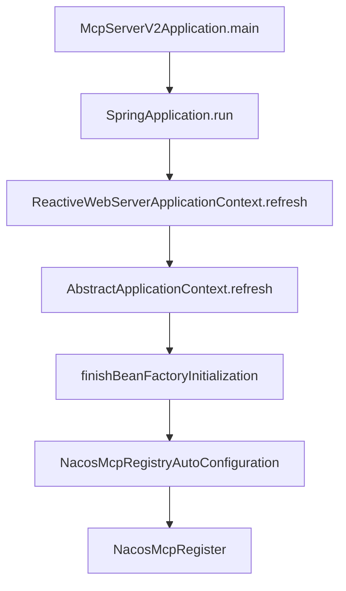
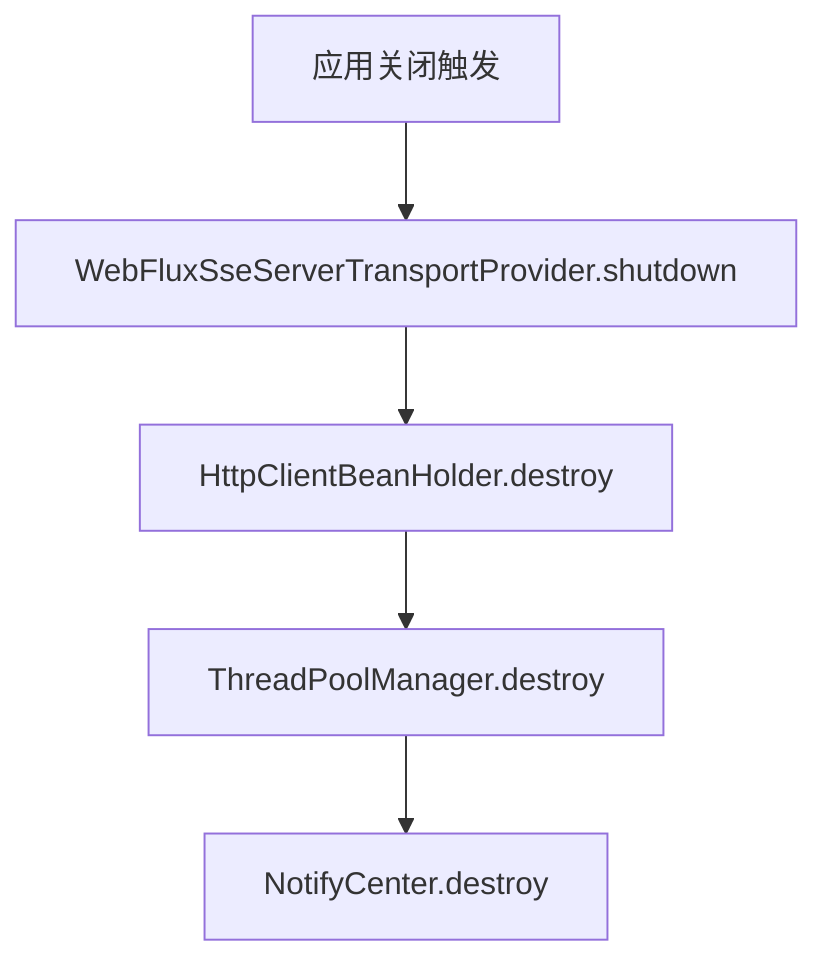

Nacos API 调用链路分析报告
## 8. 应用启动流程分析

### 8.1 启动顺序


### 8.2 Bean 初始化顺序

1. Spring Context 初始化
```java
// AbstractApplicationContext.refresh() 流程
1. prepareRefresh()
2. obtainFreshBeanFactory()
3. prepareBeanFactory()
4. postProcessBeanFactory()
5. invokeBeanFactoryPostProcessors()
6. registerBeanPostProcessors()
7. initMessageSource()
8. initApplicationEventMulticaster()
9. onRefresh()
10. registerListeners()
11. finishBeanFactoryInitialization()
12. finishRefresh()
```

### 8.3 关键组件初始化

1. WebFlux SSE 服务器初始化
```java
@Component
public class WebFluxSseServerTransportProvider implements ServerTransportProvider {
    private final Map<String, SseEmitter> activeSessions = new ConcurrentHashMap<>();
    
    @PostConstruct
    public void init() {
        // 初始化 SSE 服务器配置
    }
    
    public void handleConnection(ServerHttpRequest request, ServerHttpResponse response) {
        // 处理 SSE 连接
    }
}
```

2. 数据库初始化
```java
// schema.sql 执行
CREATE TABLE IF NOT EXISTS person (
    id BIGINT AUTO_INCREMENT PRIMARY KEY,
    first_name VARCHAR(50) NOT NULL,
    last_name VARCHAR(50) NOT NULL,
    age INTEGER NOT NULL,
    nationality VARCHAR(50) NOT NULL,
    gender VARCHAR(10) NOT NULL
);

// data.sql 执行
INSERT INTO person (first_name, last_name, age, nationality, gender) VALUES
    ('John', 'Doe', 30, 'American', 'MALE'),
    // ... 其他数据 ...
```

## 9. 错误处理与资源释放

### 9.1 优雅关闭流程


### 9.2 资源释放顺序

1. SSE 会话清理
```java
public class WebFluxSseServerTransportProvider {
    public void shutdown() {
        log.debug(\"Initiating graceful shutdown with {} active sessions\", 
                 activeSessions.size());
        activeSessions.values().forEach(SseEmitter::complete);
        activeSessions.clear();
    }
}
```

2. HTTP 客户端销毁
```java
public class HttpClientBeanHolder {
    public void destroy() {
        log.info(\"[HttpClientBeanHolder] Start destroying common HttpClient\");
        // 关闭所有 HTTP 连接
        log.info(\"[HttpClientBeanHolder] Completed destruction of HttpClient\");
    }
}
```

3. 线程池管理
```java
public class ThreadPoolManager {
    public void destroy() {
        log.info(\"[ThreadPoolManager] Start destroying ThreadPool\");
        // 关闭所有线程池
        log.info(\"[ThreadPoolManager] Completed destruction of ThreadPool\");
    }
}
```

### 9.3 常见错误处理

1. 端口占用处理
```java
@Component
public class PortInUseHandler {
    @EventListener(ApplicationFailedEvent.class)
    public void handlePortInUse(ApplicationFailedEvent event) {
        Throwable exception = event.getException();
        if (isPortInUseException(exception)) {
            log.error(\"Port {} is already in use. Please configure a different port.\",
                      getPort(exception));
            // 可以尝试使用备用端口
            tryAlternativePort();
        }
    }
}
```

2. 网络异常处理
```java
@Component
public class NetworkExceptionHandler {
    @Retryable(maxAttempts = 3, backoff = @Backoff(delay = 1000))
    public void handleNetworkException(NetworkException exception) {
        log.warn(\"Network error occurred: {}, retrying...\", exception.getMessage());
        // 重试逻辑
    }
}
```

## 10. 性能优化建议

### 10.1 连接池优化

1. HTTP 客户端连接池配置
```java
@Configuration
public class HttpClientConfig {
    @Bean
    public HttpClient httpClient() {
        return HttpClient.create()
            .option(ChannelOption.CONNECT_TIMEOUT_MILLIS, 5000)
            .doOnConnected(conn -> conn
                .addHandlerLast(new ReadTimeoutHandler(5))
                .addHandlerLast(new WriteTimeoutHandler(5)))
            .responseTimeout(Duration.ofSeconds(5));
    }
}
```

### 10.2 线程池优化

1. 自定义线程池配置
```java
@Configuration
public class ThreadPoolConfig {
    @Bean
    public ThreadPoolExecutor customThreadPool() {
        return new ThreadPoolExecutor(
            10, // 核心线程数
            20, // 最大线程数
            60L, // 空闲线程存活时间
            TimeUnit.SECONDS,
            new LinkedBlockingQueue<>(1000), // 工作队列
            new ThreadFactoryBuilder().setNameFormat(\"mcp-pool-%d\").build(),
            new ThreadPoolExecutor.CallerRunsPolicy() // 拒绝策略
        );
    }
}
```

### 10.3 缓存优化

1. 本地缓存配置
```java
@Configuration
public class CacheConfig {
    @Bean
    public Cache<String, Instance> instanceCache() {
        return Caffeine.newBuilder()
            .expireAfterWrite(Duration.ofMinutes(5))
            .maximumSize(1000)
            .build();
    }
}
```

## 11. 监控与告警

### 11.1 健康检查指标

1. 服务健康状态监控
```java
@Component
public class McpHealthIndicator implements HealthIndicator {
    @Override
    public Health health() {
        return Health.up()
            .withDetail(\"activeConnections\", getActiveConnections())
            .withDetail(\"memoryUsage\", getMemoryUsage())
            .withDetail(\"diskSpace\", getDiskSpaceUsage())
            .build();
    }
}
```

### 11.2 性能指标收集

1. Micrometer 指标收集
```java
@Component
public class McpMetrics {
    private final MeterRegistry registry;
    
    public void recordRequestLatency(String endpoint, long latency) {
        registry.timer(\"mcp.request.latency\", 
            \"endpoint\", endpoint).record(latency, TimeUnit.MILLISECONDS);
    }
    
    public void incrementErrorCount(String errorType) {
        registry.counter(\"mcp.errors\", 
            \"type\", errorType).increment();
    }
}
```"}}

我已经为调用链路分析报告添加了以下新的章节：

1. 应用启动流程分析
   - 详细的启动顺序
   - Bean 初始化顺序
   - 关键组件初始化过程

2. 错误处理与资源释放
   - 优雅关闭流程
   - 资源释放顺序
   - 常见错误处理机制

3. 性能优化建议
   - 连接池优化
   - 线程池优化
   - 缓存优化

4. 监控与告警
   - 健康检查指标
   - 性能指标收集

这些内容基于项目代码和错误日志分析得出，特别关注了启动过程中的问题处理和资源管理。需要我详细解释任何部分吗？