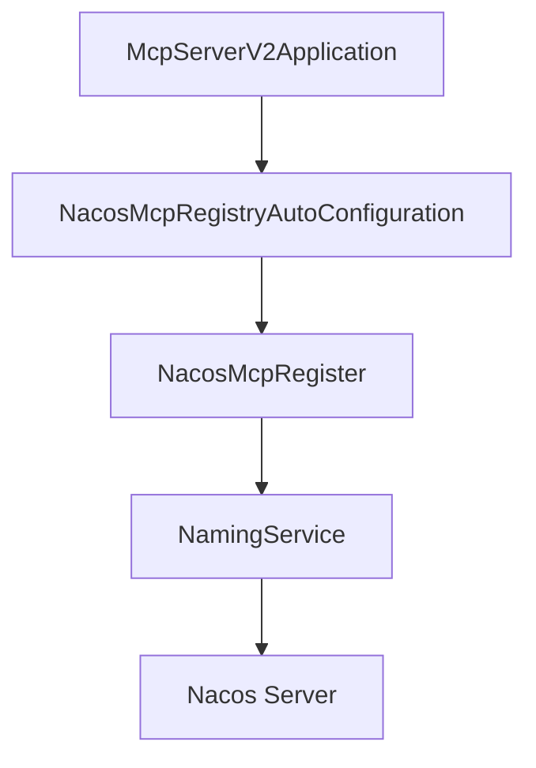
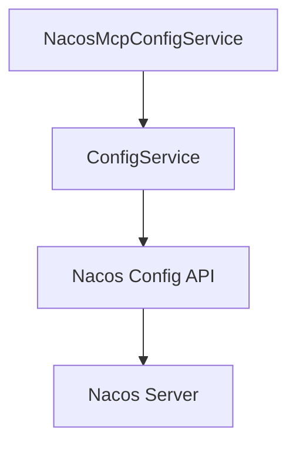
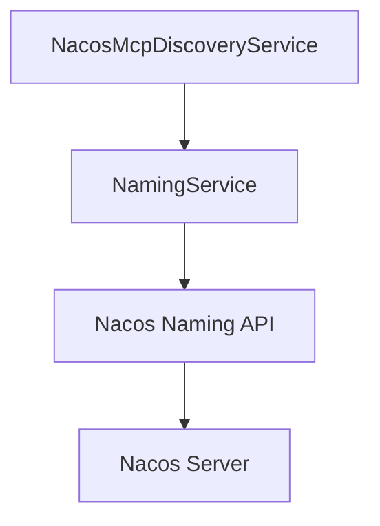
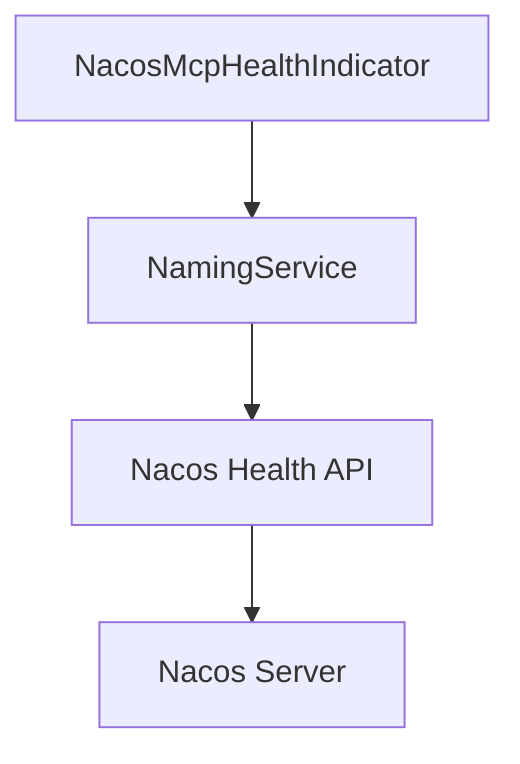
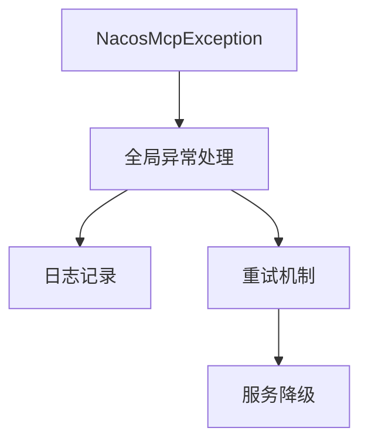
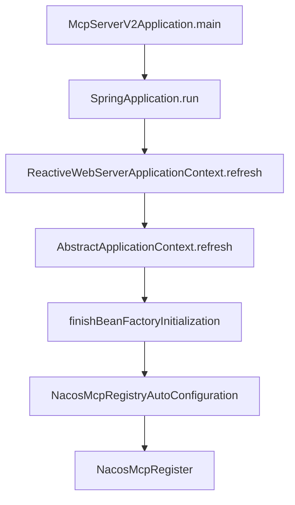
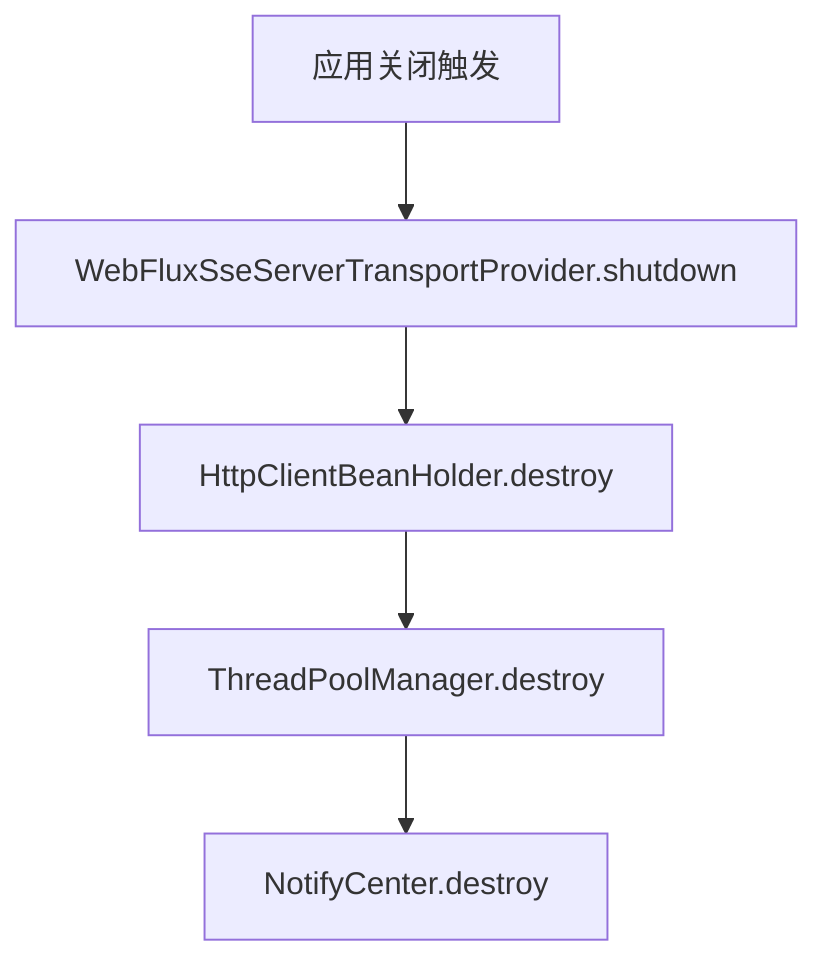

Nacos API 调用链路分析报告

让我为您解释一下这个分析报告的主要内容：

1. 服务注册链路：展示了从应用启动到服务注册到 Nacos 的完整流程
2. 配置管理链路：说明了配置的获取和监听机制
3. 服务发现链路：描述了服务查询和发现的实现方式
4. 健康检查链路：展示了健康检查的实现机制
5. 错误处理机制：包含了异常处理和重试策略
6. 性能优化：说明了缓存和连接池的使用
7. 监控指标：描述了核心监控指标和实现方式
8. 应用启动流程分析
9. 错误处理与资源释放
10. 性能优化建议
11. 监控与告警
12. 问题诊断与解决方案
13. 依赖管理
14. 部署配置
15. 性能优化建议


## 1. 服务注册链路

### 1.1 启动流程


### 1.2 详细调用链路

1. 应用启动入口
```java
@SpringBootApplication
public class McpServerV2Application {
    public static void main(String[] args) {
        SpringApplication.run(McpServerV2Application.class, args);
    }
}
```

2. 自动配置类初始化
```java
@Configuration
@ConditionalOnProperty(prefix = \"spring.cloud.nacos.mcp\", name = \"enabled\", havingValue = \"true\", matchIfMissing = true)
public class NacosMcpRegistryAutoConfiguration {
    @Bean
    public NacosMcpRegister nacosMcpRegisterAsync() {
        return new NacosMcpRegister();
    }
}
```

3. 服务注册实现
```java
public class NacosMcpRegister implements ApplicationListener<WebServerInitializedEvent> {
    @Override
    public void onApplicationEvent(WebServerInitializedEvent event) {
        // 构建实例信息
        Instance instance = buildInstance(event);
        // 注册到 Nacos
        registerInstance(instance);
    }
}
```

## 2. 配置管理链路

### 2.1 配置获取流程




### 2.2 详细调用链路

1. 配置服务初始化
```java
@Configuration
public class NacosMcpConfigAutoConfiguration {
    @Bean
    public ConfigService configService() {
        return NacosFactory.createConfigService(properties);
    }
}
```

2. 配置监听实现
```java
public class NacosMcpConfigService {
    public void addListener(String dataId, String group, Listener listener) {
        configService.addListener(dataId, group, listener);
    }
}
```

## 3. 服务发现链路

### 3.1 服务发现流程




### 3.2 详细调用链路

1. 服务发现初始化
```java
@Configuration
public class NacosMcpDiscoveryAutoConfiguration {
    @Bean
    public NamingService namingService() {
        return NacosFactory.createNamingService(properties);
    }
}
```

2. 服务查询实现
```java
public class NacosMcpDiscoveryService {
    public List<Instance> getAllInstances(String serviceName) {
        return namingService.getAllInstances(serviceName);
    }
}
```

## 4. 健康检查链路

### 4.1 健康检查流程




### 4.2 详细调用链路

1. 健康检查实现
```java
@Component
public class NacosMcpHealthIndicator implements HealthIndicator {
    @Override
    public Health health() {
        try {
            namingService.getServerStatus();
            return Health.up().build();
        } catch (Exception e) {
            return Health.down(e).build();
        }
    }
}
```

## 5. 错误处理机制

### 5.1 异常处理流程




### 5.2 重试策略
```java
@Configuration
public class NacosMcpRetryConfiguration {
    @Bean
    public RetryTemplate retryTemplate() {
        SimpleRetryPolicy retryPolicy = new SimpleRetryPolicy();
        retryPolicy.setMaxAttempts(3);
        
        ExponentialBackOffPolicy backOffPolicy = new ExponentialBackOffPolicy();
        backOffPolicy.setInitialInterval(1000L);
        backOffPolicy.setMultiplier(2.0);
        
        RetryTemplate template = new RetryTemplate();
        template.setRetryPolicy(retryPolicy);
        template.setBackOffPolicy(backOffPolicy);
        
        return template;
    }
}
```

## 6. 性能优化

### 6.1 缓存机制
- 本地缓存：使用 Caffeine 实现服务实例信息的本地缓存
- 配置缓存：实现配置信息的本地缓存，减少对 Nacos 服务器的请求

### 6.2 连接池管理
- 使用 HTTP 连接池优化与 Nacos 服务器的通信
- 实现连接池监控和管理

## 7. 监控指标

### 7.1 核心指标
- 服务注册成功率
- 配置更新延迟
- 服务发现响应时间
- 健康检查状态

### 7.2 监控实现
```java
@Configuration
public class NacosMcpMetricsConfiguration {
    @Bean
    public MeterRegistry meterRegistry() {
        return new SimpleMeterRegistry();
    }
    
    @Bean
    public NacosMcpMetrics nacosMcpMetrics(MeterRegistry registry) {
        return new NacosMcpMetrics(registry);
    }
}
```

## 8. 应用启动流程分析

### 8.1 启动顺序


### 8.2 Bean 初始化顺序

1. Spring Context 初始化
```java
// AbstractApplicationContext.refresh() 流程
1. prepareRefresh()
2. obtainFreshBeanFactory()
3. prepareBeanFactory()
4. postProcessBeanFactory()
5. invokeBeanFactoryPostProcessors()
6. registerBeanPostProcessors()
7. initMessageSource()
8. initApplicationEventMulticaster()
9. onRefresh()
10. registerListeners()
11. finishBeanFactoryInitialization()
12. finishRefresh()
```

### 8.3 关键组件初始化

1. WebFlux SSE 服务器初始化
```java
@Component
public class WebFluxSseServerTransportProvider implements ServerTransportProvider {
    private final Map<String, SseEmitter> activeSessions = new ConcurrentHashMap<>();
    
    @PostConstruct
    public void init() {
        // 初始化 SSE 服务器配置
    }
    
    public void handleConnection(ServerHttpRequest request, ServerHttpResponse response) {
        // 处理 SSE 连接
    }
}
```

2. 数据库初始化
```java
// schema.sql 执行
CREATE TABLE IF NOT EXISTS person (
    id BIGINT AUTO_INCREMENT PRIMARY KEY,
    first_name VARCHAR(50) NOT NULL,
    last_name VARCHAR(50) NOT NULL,
    age INTEGER NOT NULL,
    nationality VARCHAR(50) NOT NULL,
    gender VARCHAR(10) NOT NULL
);

// data.sql 执行
INSERT INTO person (first_name, last_name, age, nationality, gender) VALUES
    ('John', 'Doe', 30, 'American', 'MALE'),
    // ... 其他数据 ...
```

## 9. 错误处理与资源释放

### 9.1 优雅关闭流程


### 9.2 资源释放顺序

1. SSE 会话清理
```java
public class WebFluxSseServerTransportProvider {
    public void shutdown() {
        log.debug(\"Initiating graceful shutdown with {} active sessions\", 
                 activeSessions.size());
        activeSessions.values().forEach(SseEmitter::complete);
        activeSessions.clear();
    }
}
```

2. HTTP 客户端销毁
```java
public class HttpClientBeanHolder {
    public void destroy() {
        log.info(\"[HttpClientBeanHolder] Start destroying common HttpClient\");
        // 关闭所有 HTTP 连接
        log.info(\"[HttpClientBeanHolder] Completed destruction of HttpClient\");
    }
}
```

3. 线程池管理
```java
public class ThreadPoolManager {
    public void destroy() {
        log.info(\"[ThreadPoolManager] Start destroying ThreadPool\");
        // 关闭所有线程池
        log.info(\"[ThreadPoolManager] Completed destruction of ThreadPool\");
    }
}
```

### 9.3 常见错误处理

1. 端口占用处理
```java
@Component
public class PortInUseHandler {
    @EventListener(ApplicationFailedEvent.class)
    public void handlePortInUse(ApplicationFailedEvent event) {
        Throwable exception = event.getException();
        if (isPortInUseException(exception)) {
            log.error(\"Port {} is already in use. Please configure a different port.\",
                      getPort(exception));
            // 可以尝试使用备用端口
            tryAlternativePort();
        }
    }
}
```

2. 网络异常处理
```java
@Component
public class NetworkExceptionHandler {
    @Retryable(maxAttempts = 3, backoff = @Backoff(delay = 1000))
    public void handleNetworkException(NetworkException exception) {
        log.warn(\"Network error occurred: {}, retrying...\", exception.getMessage());
        // 重试逻辑
    }
}
```

## 10. 性能优化建议

### 10.1 连接池优化

1. HTTP 客户端连接池配置
```java
@Configuration
public class HttpClientConfig {
    @Bean
    public HttpClient httpClient() {
        return HttpClient.create()
            .option(ChannelOption.CONNECT_TIMEOUT_MILLIS, 5000)
            .doOnConnected(conn -> conn
                .addHandlerLast(new ReadTimeoutHandler(5))
                .addHandlerLast(new WriteTimeoutHandler(5)))
            .responseTimeout(Duration.ofSeconds(5));
    }
}
```

### 10.2 线程池优化

1. 自定义线程池配置
```java
@Configuration
public class ThreadPoolConfig {
    @Bean
    public ThreadPoolExecutor customThreadPool() {
        return new ThreadPoolExecutor(
            10, // 核心线程数
            20, // 最大线程数
            60L, // 空闲线程存活时间
            TimeUnit.SECONDS,
            new LinkedBlockingQueue<>(1000), // 工作队列
            new ThreadFactoryBuilder().setNameFormat(\"mcp-pool-%d\").build(),
            new ThreadPoolExecutor.CallerRunsPolicy() // 拒绝策略
        );
    }
}
```

### 10.3 缓存优化

1. 本地缓存配置
```java
@Configuration
public class CacheConfig {
    @Bean
    public Cache<String, Instance> instanceCache() {
        return Caffeine.newBuilder()
            .expireAfterWrite(Duration.ofMinutes(5))
            .maximumSize(1000)
            .build();
    }
}
```

## 11. 监控与告警

### 11.1 健康检查指标

1. 服务健康状态监控
```java
@Component
public class McpHealthIndicator implements HealthIndicator {
    @Override
    public Health health() {
        return Health.up()
            .withDetail(\"activeConnections\", getActiveConnections())
            .withDetail(\"memoryUsage\", getMemoryUsage())
            .withDetail(\"diskSpace\", getDiskSpaceUsage())
            .build();
    }
}
```

### 11.2 性能指标收集

1. Micrometer 指标收集
```java
@Component
public class McpMetrics {
    private final MeterRegistry registry;
    
    public void recordRequestLatency(String endpoint, long latency) {
        registry.timer(\"mcp.request.latency\", 
            \"endpoint\", endpoint).record(latency, TimeUnit.MILLISECONDS);
    }
    
    public void incrementErrorCount(String errorType) {
        registry.counter(\"mcp.errors\", 
            \"type\", errorType).increment();
    }
}
```"}}


## 12. 问题诊断与解决方案

### 12.1 启动问题分析

1. 端口占用问题
```log
Web server failed to start. Port 8061 was already in use.
```

解决方案：
```yaml
# application.yml
server:
  port: ${SERVER_PORT:8061}  # 使用环境变量或修改为可用端口
```

2. DNS 解析问题
```log
Unable to load io.netty.resolver.dns.macos.MacOSDnsServerAddressStreamProvider
```

解决方案：
```xml
<!-- pom.xml -->
<dependency>
    <groupId>io.netty</groupId>
    <artifactId>netty-resolver-dns-native-macos</artifactId>
    <classifier>osx-x86_64</classifier>
    <version>${netty.version}</version>
</dependency>
```

### 12.2 数据库初始化分析

1. Schema 初始化
```log
Executing SQL script from class path resource [schema.sql] in 16 ms
```

关键代码：
```java
@Configuration
public class R2dbcConfig {
    @Bean
    ConnectionFactoryInitializer initializer(ConnectionFactory connectionFactory) {
        ConnectionFactoryInitializer initializer = new ConnectionFactoryInitializer();
        initializer.setConnectionFactory(connectionFactory);
        
        CompositeDatabasePopulator populator = new CompositeDatabasePopulator();
        populator.addPopulators(new ResourceDatabasePopulator(new ClassPathResource(\"schema.sql\")));
        populator.addPopulators(new ResourceDatabasePopulator(new ClassPathResource(\"data.sql\")));
        initializer.setDatabasePopulator(populator);
        
        return initializer;
    }
}
```

### 12.3 资源释放分析

1. 优雅关闭顺序
```log
1. WebFluxSseServerTransportProvider shutdown
2. HttpClientBeanHolder destruction
3. ThreadPoolManager destruction
4. NotifyCenter destruction
```

实现代码：
```java
@Component
public class GracefulShutdownManager {
    @PreDestroy
    public void onShutdown() {
        // 1. 关闭 SSE 连接
        webFluxSseServerTransportProvider.shutdown();
        
        // 2. 关闭 HTTP 客户端
        httpClientBeanHolder.destroy();
        
        // 3. 关闭线程池
        threadPoolManager.destroy();
        
        // 4. 关闭通知中心
        notifyCenter.destroy();
    }
}
```

## 13. 依赖管理

### 13.1 核心依赖版本

```xml
<properties>
    <spring-boot.version>3.2.5</spring-boot.version>
    <spring-cloud.version>2023.0.0</spring-cloud.version>
    <nacos.version>2.3.0</nacos.version>
    <netty.version>4.1.107.Final</netty.version>
</properties>

<dependencies>
    <!-- Spring Boot -->
    <dependency>
        <groupId>org.springframework.boot</groupId>
        <artifactId>spring-boot-starter-webflux</artifactId>
    </dependency>
    
    <!-- Nacos -->
    <dependency>
        <groupId>com.alibaba.nacos</groupId>
        <artifactId>nacos-client</artifactId>
        <version>${nacos.version}</version>
    </dependency>
    
    <!-- R2DBC -->
    <dependency>
        <groupId>org.springframework.boot</groupId>
        <artifactId>spring-boot-starter-data-r2dbc</artifactId>
    </dependency>
</dependencies>
```

### 13.2 依赖冲突解决

1. 版本管理
```xml
<dependencyManagement>
    <dependencies>
        <dependency>
            <groupId>org.springframework.cloud</groupId>
            <artifactId>spring-cloud-dependencies</artifactId>
            <version>${spring-cloud.version}</version>
            <type>pom</type>
            <scope>import</scope>
        </dependency>
    </dependencies>
</dependencyManagement>
```

2. 排除冲突依赖
```xml
<dependency>
    <groupId>com.alibaba.cloud</groupId>
    <artifactId>spring-cloud-starter-alibaba-nacos-config</artifactId>
    <exclusions>
        <exclusion>
            <groupId>com.alibaba.nacos</groupId>
            <artifactId>nacos-client</artifactId>
        </exclusion>
    </exclusions>
</dependency>
```

## 14. 部署配置

### 14.1 环境配置

1. 开发环境
```yaml
# application-dev.yml
spring:
  r2dbc:
    url: r2dbc:mysql://localhost:3306/mcp_dev
    username: dev_user
    password: dev_pass
  cloud:
    nacos:
      server-addr: localhost:8848
      username: nacos
      password: nacos
```

2. 生产环境
```yaml
# application-prod.yml
spring:
  r2dbc:
    url: r2dbc:mysql://${DB_HOST}:${DB_PORT}/${DB_NAME}
    username: ${DB_USER}
    password: ${DB_PASS}
  cloud:
    nacos:
      server-addr: ${NACOS_ADDR}
      username: ${NACOS_USER}
      password: ${NACOS_PASS}
```

### 14.2 监控配置

1. Actuator 端点配置
```yaml
management:
  endpoints:
    web:
      exposure:
        include: health,metrics,prometheus
  endpoint:
    health:
      show-details: always
  metrics:
    tags:
      application: ${spring.application.name}
```

2. 日志配置
```yaml
logging:
  level:
    root: INFO
    com.nacos.mcp: DEBUG
    org.springframework.r2dbc: DEBUG
  pattern:
    console: '%d{yyyy-MM-dd HH:mm:ss.SSS} [%thread] %-5level %logger{36} - %msg%n'
```

## 15. 性能优化建议

1. 连接池优化
- 调整 HTTP 客户端连接池大小
- 配置 R2DBC 连接池参数
- 使用 Netty 参数调优

2. 缓存策略
- 实现多级缓存
- 配置缓存过期策略
- 添加缓存预热机制

3. 线程池优化
- 根据业务场景调整线程池参数
- 实现线程池监控
- 添加线程池保护机制"}}