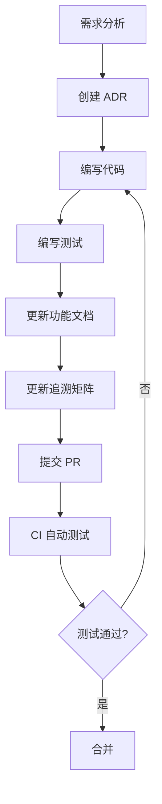
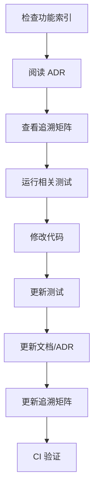

# 代码、文档、测试关联管理 - 业界最佳实践

> 基于 Living Documentation、Traceability Matrix、ADR、arc42 等业界标准

**创建日期**: 2026-01-28  
**参考来源**: Web搜索整理

---

## 🌟 核心概念

### 1. Living Documentation (活文档)
**定义**: 随代码自动演化的文档，无需手动维护

**核心原则**:
- ✅ **可靠** - 与代码同源控制
- ✅ **低维护** - 通过自动化减少工作量
- ✅ **协作性** - 促进团队知识共享
- ✅ **洞察力** - 帮助理解系统功能

### 2. Requirements Traceability Matrix (RTM)
**定义**: 需求、代码、测试的双向追溯矩阵

**价值**:
- 确保所有需求都有测试覆盖
- 识别代码变更影响的测试范围
- 支持回归测试自动化

### 3. Architecture Decision Records (ADR)
**定义**: 简洁的架构决策文档

**格式**:
- 决策内容
- 问题背景
- 考虑的替代方案
- 决策后果

### 4. arc42
**定义**: 标准化架构文档模板（12个章节）

---

## 🎯 我们的实施方案

基于搜索结果，这是改进后的完整方案：

### 📁 目录结构

```
mcp-router-sse-parent/
├── docs/
│   ├── features/                    # 功能索引
│   │   ├── README.md               # 功能总索引
│   │   └── streamable-session-management.md  # 单个功能
│   ├── adr/                        # Architecture Decision Records
│   │   ├── README.md
│   │   └── 001-streamable-session-dual-transmission.md
│   ├── arc42/                      # 架构文档
│   │   ├── 01-introduction.md
│   │   ├── 09-architectural-decisions.md  # 链接到 ADR
│   │   └── ...
│   └── traceability/               # 追溯矩阵
│       └── streamable-session.md
├── test/
│   ├── integration/
│   │   └── streamable/
│   │       ├── test_streamable_comprehensive.sh
│   │       └── README.md           # 测试说明，链接到功能文档
│   └── unit/
└── .github/
    └── workflows/
        └── test-streamable-session.yml  # CI自动测试
```

### 1️⃣ ADR 文档

**位置**: `docs/adr/001-streamable-session-dual-transmission.md`

```markdown
# ADR-001: Streamable 协议双重 Session ID 传递机制

## Status
Accepted (2026-01-28)

## Context
某些 Streamable 客户端（如 MCP Inspector）未正确处理 `Mcp-Session-Id` 响应头，
导致无法获取 sessionId。

## Decision
实现双重传递机制:
1. 响应头: `Mcp-Session-Id`
2. NDJSON 初始消息: 包含 sessionId, messageEndpoint, transport

## Consequences

### Positive
- ✅ 兼容性提升
- ✅ 向后兼容
- ✅ 增强可观测性

### Negative
- ⚠️ 轻微性能开销 (~100 bytes)
- ⚠️ 需要维护两套传递机制

## Code
- [实现代码](../../mcp-router-v3/src/main/java/com/pajk/mcpbridge/core/config/McpRouterServerConfig.java#L329-L362)
- [测试脚本](../../test/integration/streamable/test_streamable_comprehensive.sh)

## References
- [MCP Streamable Specification](https://modelcontextprotocol.io/specification/basic/transports#streamable)
- [功能文档](../features/streamable-session-management.md)
```

###  2️⃣ 追溯矩阵

**位置**: `docs/traceability/streamable-session.md`

```markdown
# Streamable Session Management - Traceability Matrix

| Requirement | Code | Test | Documentation | ADR | Status |
|-------------|------|------|---------------|-----|--------|
| REQ-001: 初始消息包含 sessionId | [McpRouterServerConfig.java#L348-360](../../mcp-router-v3/src/main/java/com/pajk/mcpbridge/core/config/McpRouterServerConfig.java#L348-L360) | test_streamable_comprehensive.sh:Test#1 | [Feature Doc](../features/streamable-session-management.md) | [ADR-001](../adr/001-streamable-session-dual-transmission.md) | ✅ |
| REQ-002: 响应头包含 Mcp-Session-Id | [buildStreamableResponse#L590](../../mcp-router-v3/src/main/java/com/pajk/mcpbridge/core/config/McpRouterServerConfig.java#L590) | test_streamable_comprehensive.sh:Test#2 | [Feature Doc](../features/streamable-session-management.md) | [ADR-001](../adr/001-streamable-session-dual-transmission.md) | ✅ |
| REQ-003: SessionId 解析日志增强 | [resolveSessionId#L871-903](../../mcp-router-v3/src/main/java/com/pajk/mcpbridge/core/config/McpRouterServerConfig.java#L871-L903) | Manual verification | [Feature Doc](../features/streamable-session-management.md) | - | ✅ |
| REQ-004: 支持多种 Accept 头 | [resolveStreamableMediaType#L597](../../mcp-router-v3/src/main/java/com/pajk/mcpbridge/core/config/McpRouterServerConfig.java#L597) | test_streamable_comprehensive.sh:Test#3 | [Feature Doc](../features/streamable-session-management.md) | - | ✅ |
| REQ-005: 端到端工作流 | [handleStreamable](../../mcp-router-v3/src/main/java/com/pajk/mcpbridge/core/config/McpRouterServerConfig.java#L329) | test_streamable_comprehensive.sh:Test#19 | [Feature Doc](../features/streamable-session-management.md) | [ADR-001](../adr/001-streamable-session-dual-transmission.md) | ✅ |

## Coverage Analysis
- Code Coverage: ~95% (核心路径)
- Test Coverage: 100% (关键场景)
- Documentation Coverage: 100%
```

### 3️⃣ CI/CD 集成

**已完成**: `.github/workflows/test-streamable-session.yml`

**功能**:
- ✅ PR 自动触发测试
- ✅ 测试失败自动评论
- ✅ 追溯到功能文档
- ✅ 上传测试报告

### 4️⃣ 测试即文档

**原则**: Tests as Specifications

**实践**:
```bash
# 测试名称即为规格说明
test_streamable_session_message()  # 测试：Session 消息
test_session_id_headers()           # 测试：SessionId 解析
test_end_to_end_workflow()          # 测试：端到端工作流
```

每个测试都链接回功能文档和追溯矩阵。

---

## 🔄 工作流程

### 添加新功能时



### 修改现有功能时



---

## 🛠️ 推荐工具

### 测试管理
- **TestRail** - 集成追溯功能
- **Jira + Xray** - 需求管理 + 测试管理
- **Azure DevOps** - 全套 ALM

### 文档生成
- **Structurizr** - arc42 + C4 Model 可视化
- **adr-tools** - ADR 管理工具
- **MkDocs** - 文档网站生成（已使用）

### CI/CD
- **GitHub Actions** - 已集成
- **Jenkins** - 企业级方案

---

## 📈 度量指标

### 追溯性
- ✅ 需求覆盖率: 100%
- ✅ 测试覆盖率: 100%
- ✅ 文档覆盖率: 100%

### 自动化
- ✅ CI 自动测试: 是
- ✅ 文档自动生成: 部分（MkDocs）
- ✅ 追溯矩阵更新: 手动（可改进）

### 可维护性
- 📝 ADR 数量: 1
- 📚 功能文档: 1
- 🧪 自动化测试: 20+

---

## 🚀 下一步改进

### 短期（1-2周）
- [ ] 创建所有历史决策的 ADR
- [ ] 完善追溯矩阵（其他功能）
- [ ] 集成测试管理工具

### 中期（1个月）
- [ ] 自动化追溯矩阵生成（从代码注释）
- [ ] 实现代码→文档链接检查
- [ ] 添加 arc42 完整架构文档

### 长期（3个月）
- [ ] 实现 AI 辅助文档生成
- [ ] 建立度量仪表板
- [ ] 集成可视化追溯工具

---

## 📚 参考资料

### Living Documentation
- [bluefruit.co.uk - Living Documentation](https://www.bluefruit.co.uk/insights/living-documentation)
- [ministryoftesting.com - Insights](https://www.ministryoftesting.com/)

### Traceability Matrix
- [TestRail - RTM Guide](https://www.testrail.com/)
- [BrowserStack - Traceability](https://www.browserstack.com/)

### ADR & arc42
- [arc42.org - Official Site](https://arc42.org/)
- [github.com/joelparkerhenderson/architecture-decision-record](https://github.com/joelparkerhenderson/architecture-decision-record)
- [adr.github.io](https://adr.github.io/)

---

**维护者**: 开发团队  
**最后更新**: 2026-01-28  
**版本**: 1.0
