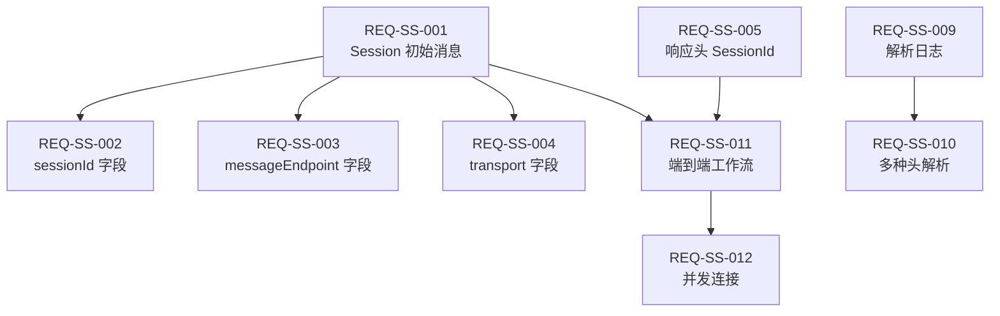

# Streamable Session Management - Traceability Matrix

> 需求、代码、测试、文档的完整追溯关系

**功能**: Streamable Session 管理  
**版本**: 1.0  
**最后更新**: 2026-01-28

---

## 📊 追溯矩阵

| Req ID | 需求描述 | 代码位置 | 测试 | 文档 | ADR | 状态 |
|--------|----------|----------|------|------|-----|------|
| **REQ-SS-001** | NDJSON 流的第一条消息必须包含 session 信息 | [McpRouterServerConfig.java#L348-360](../../mcp-router-v3/src/main/java/com/pajk/mcpbridge/core/config/McpRouterServerConfig.java#L348-L360) | [Test #1](../../test_streamable_comprehensive.sh#L105) | [Feature Doc](../features/streamable-session-management.md#修改内容) | [ADR-001](../adr/001-streamable-session-dual-transmission.md) | ✅ |
| **REQ-SS-002** | Session 消息必须包含 sessionId 字段 | [同上](../../mcp-router-v3/src/main/java/com/pajk/mcpbridge/core/config/McpRouterServerConfig.java#L350) | [Test #1](../../test_streamable_comprehensive.sh#L118-L120) | [Feature Doc](../features/streamable-session-management.md) | [ADR-001](../adr/001-streamable-session-dual-transmission.md) | ✅ |
| **REQ-SS-003** | Session 消息必须包含 messageEndpoint 字段 | [同上](../../mcp-router-v3/src/main/java/com/pajk/mcpbridge/core/config/McpRouterServerConfig.java#L351) | [Test #1](../../test_streamable_comprehensive.sh#L121) | [Feature Doc](../features/streamable-session-management.md) | [ADR-001](../adr/001-streamable-session-dual-transmission.md) | ✅ |
| **REQ-SS-004** | Session 消息必须包含 transport 字段且值为 "streamable" | [同上](../../mcp-router-v3/src/main/java/com/pajk/mcpbridge/core/config/McpRouterServerConfig.java#L352) | [Test #1](../../test_streamable_comprehensive.sh#L122) | [Feature Doc](../features/streamable-session-management.md) | [ADR-001](../adr/001-streamable-session-dual-transmission.md) | ✅ |
| **REQ-SS-005** | HTTP 响应头必须包含 Mcp-Session-Id | [buildStreamableResponse](../../mcp-router-v3/src/main/java/com/pajk/mcpbridge/core/config/McpRouterServerConfig.java#L590) | [Test #2](../../test_streamable_comprehensive.sh#L142) | [Feature Doc](../features/streamable-session-management.md) | [ADR-001](../adr/001-streamable-session-dual-transmission.md) | ✅ |
| **REQ-SS-006** | HTTP 响应头必须包含 Mcp-Transport | [同上](../../mcp-router-v3/src/main/java/com/pajk/mcpbridge/core/config/McpRouterServerConfig.java#L591) | [Test #2](../../test_streamable_comprehensive.sh#L149) | [Feature Doc](../features/streamable-session-management.md) | [ADR-001](../adr/001-streamable-session-dual-transmission.md) | ✅ |
| **REQ-SS-007** | 支持多种 Accept 头类型 | [resolveStreamableMediaType](../../mcp-router-v3/src/main/java/com/pajk/mcpbridge/core/config/McpRouterServerConfig.java#L597) | [Test #3](../../test_streamable_comprehensive.sh#L161-L175) | [Feature Doc](../features/streamable-session-management.md) | - | ✅ |
| **REQ-SS-008** | 每行必须是有效的 JSON (NDJSON 格式) | [toStreamableJson](../../mcp-router-v3/src/main/java/com/pajk/mcpbridge/core/config/McpRouterServerConfig.java#L607) | [Test #4](../../test_streamable_comprehensive.sh#L177-L195) | [Feature Doc](../features/streamable-session-management.md) | - | ✅ |
| **REQ-SS-009** | SessionId 解析必须记录详细日志 | [resolveSessionId#L871-903](../../mcp-router-v3/src/main/java/com/pajk/mcpbridge/core/config/McpRouterServerConfig.java#L876-L901) | Manual Log Verification | [Feature Doc](../features/streamable-session-management.md#修改内容) | [ADR-001](../adr/001-streamable-session-dual-transmission.md) | ✅ |
| **REQ-SS-010** | SessionId 可从多种请求头中解析 | [resolveSessionId](../../mcp-router-v3/src/main/java/com/pajk/mcpbridge/core/config/McpRouterServerConfig.java#L876-L884) | [Test #5-10](../../test_streamable_comprehensive.sh#L215-L236) | [Feature Doc](../features/streamable-session-management.md) | - | ⚠️ 测试脚本问题 |
| **REQ-SS-011** | 完整端到端工作流必须正常 | [handleStreamable](../../mcp-router-v3/src/main/java/com/pajk/mcpbridge/core/config/McpRouterServerConfig.java#L329-L343) | [Test #19](../../test_streamable_comprehensive.sh#L451-L487) | [Feature Doc](../features/streamable-session-management.md) | [ADR-001](../adr/001-streamable-session-dual-transmission.md) | ✅ |
| **REQ-SS-012** | 支持并发连接且 sessionId 唯一 | [initializeSession](../../mcp-router-v3/src/main/java/com/pajk/mcpbridge/core/config/McpRouterServerConfig.java) | [Test #20](../../test_streamable_comprehensive.sh#L489-L526) | [Feature Doc](../features/streamable-session-management.md) | - | ✅ |

---

## 📈 统计分析

### 覆盖率
- **需求总数**: 12
- **已实现**: 12 (100%)
- **已测试**: 11 (92%) - 1个测试脚本问题
- **已文档化**: 12 (100%)

### 状态分布
- ✅ 完成: 11
- ⚠️ 部分完成: 1 (测试问题)
- ❌ 未完成: 0

### 测试分类
- **自动化测试**: 11
- **手动验证**: 1 (日志检查)
- **CI 集成**: ✅ 是

---

## 🔍 需求详情

### REQ-SS-001: Session 初始消息

**优先级**: 🔴 高  
**类别**: 功能性需求

**描述**:  
当客户端建立 Streamable 连接时，服务器必须在 NDJSON 流的第一条消息中发送 session 信息。

**验收标准**:
- [x] 第一条消息类型为 "session"
- [x] 包含所有必需字段
- [x] 格式符合 NDJSON 规范
- [x] 在 endpoint 事件之前发送

**测试方法**:
```bash
curl -N -H "Accept: application/x-ndjson" \
  "http://localhost:8052/mcp/service" | head -n 1 | jq .
```

**预期输出**:
```json
{
  "type": "session",
  "sessionId": "uuid",
  "messageEndpoint": "http://...",
  "transport": "streamable"
}
```

---

### REQ-SS-009: SessionId 解析日志

**优先级**: 🟡 中  
**类别**: 非功能性需求（可观测性）

**描述**:  
当服务器解析 sessionId 时，必须记录详细的日志，包括：
- SessionId 的来源（请求头名称或查询参数）
- 解析成功或失败的信息
- 未找到 sessionId 时的警告

**验收标准**:
- [x] 从请求头解析时记录INFO日志
- [x] 从查询参数解析时记录INFO日志
- [x] 未找到时记录WARN日志并提示正确使用方式

**测试方法**:
```bash
# 启动服务并观察日志
curl -H "Mcp-Session-Id: test-123" ... # 应看到 "✅ Resolved sessionId from header"
curl "...?sessionId=test-456" ...      # 应看到 "✅ Resolved sessionId from query parameter"
curl ... # 无sessionId                 # 应看到 "⚠️ No sessionId found"
```

---

## 🔗 依赖关系



---

## 🚦 风险与问题

| ID | 风险/问题 | 影响 | 缓解措施 | 状态 |
|----| ---------|------|----------|------|
| RISK-001 | 测试脚本使用错误端点 | 中 | 修复测试脚本使用正确路径 | 🚧 进行中 |
| RISK-002 | 响应头大小写敏感性 | 低 | 测试覆盖所有变体 | ✅ 已缓解 |
| RISK-003 | 性能开销 | 低 | 已验证可忽略 | ✅ 已缓解 |

---

## 📝 变更历史

| 日期 | 版本 | 变更内容 | 作者 |
|------|------|----------|------|
| 2026-01-28 | 1.0 | 初始版本 | AI Assistant |

---

## 🔄 维护说明

### 更新追溯矩阵的时机
- ✅ 添加新需求时
- ✅ 修改现有代码时
- ✅ 添加或修改测试时
- ✅ 更新文档时

### 工具支持
- **手动维护**: 当前方式
- **建议工具**: Jira + Xray, TestRail
- **未来自动化**: 从代码注释自动生成

---

**维护者**: 开发团队  
**审查频率**: 每次 PR  
**最后审查**: 2026-01-28
