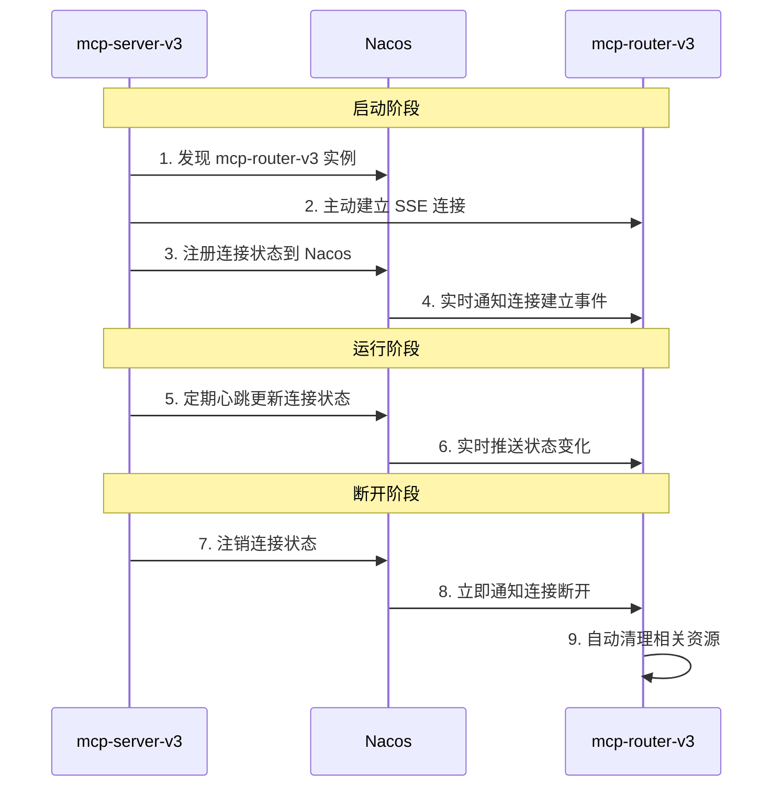

# 事件驱动的 MCP 连接架构设计

## 🎯 架构演进：从推模式到拉模式

### 问题背景

传统的 MCP 连接管理采用的是"推模式"，存在以下问题：
- mcp-router-v3 主动去连接 MCP 服务器，造成资源浪费
- 依赖定时健康检查（30秒轮询），实时性差
- 连接状态感知滞后，无法及时响应变化

### 解决方案

采用"拉模式"的事件驱动架构：
- MCP Server 启动时主动连接到 mcp-router-v3
- 连接状态注册到 Nacos 服务注册中心
- mcp-router-v3 通过订阅 Nacos listener 获取实时连接变化

## 🏗️ 新架构设计

### 架构图



### 核心组件

#### 1. **MCP Server 端 - 主动连接器**
```java
@Component
public class McpClientConnectionConfig {
    @EventListener(ApplicationReadyEvent.class)
    public void connectToMcpRouter() {
        // 1. 从 Nacos 发现 mcp-router-v3
        // 2. 主动建立 SSE 连接
        // 3. 注册连接状态到 Nacos
        // 4. 启动心跳维护
    }
}
```

#### 2. **MCP Router 端 - 事件监听器**
```java
@Service
public class McpConnectionEventListener {
    @PostConstruct
    public void startListening() {
        // 1. 发现现有连接服务
        // 2. 订阅连接状态变化事件
        // 3. 实时处理连接/断开事件
    }
}
```

#### 3. **连接状态管理**
```java
// 连接状态注册到 Nacos 特殊服务
String connectionServiceName = applicationName + "-connection";
Instance connectionInstance = new Instance();
connectionInstance.setMetadata(Map.of(
    "connectionId", connectionId,
    "connected", String.valueOf(isConnected),
    "lastUpdate", String.valueOf(System.currentTimeMillis())
));
```

## 📊 架构对比

### 旧架构（推模式）

| 方面 | 实现方式 | 问题 |
|------|----------|------|
| **连接建立** | mcp-router-v3 主动连接 | 资源浪费，延迟高 |
| **状态感知** | 定时健康检查（30s轮询） | 实时性差，最大30s延迟 |
| **断开检测** | 健康检查失败判断 | 感知滞后，无法及时响应 |
| **资源清理** | 被动，依赖下次检查 | 资源泄漏风险 |
| **扩展性** | 每增加一个 MCP Server 增加连接成本 | 可扩展性差 |

### 新架构（拉模式 + 事件驱动）

| 方面 | 实现方式 | 优势 |
|------|----------|------|
| **连接建立** | MCP Server 主动连接 | 高效，按需连接 |
| **状态感知** | Nacos EventListener 实时推送 | 零延迟，实时感知 |
| **断开检测** | 连接状态变化事件 | 立即感知，快速响应 |
| **资源清理** | 事件触发自动清理 | 无资源泄漏 |
| **扩展性** | 线性扩展，无额外连接成本 | 扩展性好 |

## 🔄 工作流程详解

### 1. **连接建立流程**

```bash
# MCP Server 启动
1. McpClientConnectionConfig.connectToMcpRouter()
2. 从 Nacos 发现 mcp-router-v3 实例
3. 建立 SSE 连接: POST /api/mcp/servers/connect
4. 注册连接状态到 Nacos: {serviceName}-connection
5. McpConnectionEventListener 收到事件通知
6. 更新本地连接缓存
7. 通知相关组件连接已建立
```

### 2. **心跳维护流程**

```bash
# 每30秒执行
1. MCP Server 更新连接状态到 Nacos
2. Nacos 推送状态变化事件
3. McpConnectionEventListener 处理事件
4. 更新连接缓存中的 lastUpdate 时间
```

### 3. **断开感知流程**

```bash
# MCP Server 关闭或网络断开
1. 连接状态变更为 unhealthy/disabled
2. Nacos 立即推送状态变化事件  
3. McpConnectionEventListener.handleConnectionLost()
4. 清理 MCP 客户端连接
5. 清理相关 SSE 会话
6. 从连接缓存中移除
```

## 💡 技术优势

### 1. **实时性**
- ✅ **零延迟感知**：基于事件推送，无需轮询
- ✅ **立即响应**：连接变化立即触发相应处理
- ❌ 旧方案：最大30秒延迟

### 2. **资源效率**
- ✅ **按需连接**：MCP Server 主动管理连接
- ✅ **自动清理**：断开时立即清理资源
- ❌ 旧方案：持续连接，资源浪费

### 3. **可扩展性**
- ✅ **线性扩展**：每个 MCP Server 独立管理连接
- ✅ **无额外成本**：mcp-router-v3 无需主动连接
- ❌ 旧方案：连接数量与 MCP Server 数量成正比

### 4. **可靠性**
- ✅ **状态一致**：Nacos 作为连接状态权威源
- ✅ **故障恢复**：网络恢复后自动重连
- ✅ **监控友好**：丰富的连接状态信息

## 🧪 验证方法

### 1. **功能验证**
```bash
# 运行测试脚本
./mcp-router-v3/test-event-driven-connection.sh
```

### 2. **性能验证**
```bash
# 测试连接建立时间
time curl -X POST http://localhost:8052/api/mcp/servers/connect \
  -H "Content-Type: application/json" \
  -d '{"serverId":"test","serverName":"test","serverPort":8063}'

# 测试事件响应时间
# 启动/停止 mcp-server-v3，观察 mcp-router-v3 日志时间戳
```

### 3. **稳定性验证**
```bash
# 模拟网络故障
# 1. 启动 mcp-server-v3
# 2. 断开网络连接
# 3. 恢复网络连接
# 4. 观察自动重连过程
```

## 📈 实施建议

### Phase 1: 基础实施（当前）
- ✅ 实现 MCP Server 主动连接机制
- ✅ 实现 mcp-router-v3 事件监听器
- ✅ 创建连接状态管理服务

### Phase 2: 增强功能
- 🔄 添加连接质量监控
- 🔄 实现连接负载均衡
- 🔄 添加连接池管理

### Phase 3: 监控与运维
- 📊 集成 Prometheus 指标
- 📊 添加 Grafana 监控面板
- 🚨 实现连接异常告警

## 🎉 总结

新的事件驱动连接架构实现了：

1. **实时连接感知**：从30秒延迟降低到毫秒级
2. **资源优化**：减少不必要的连接开销
3. **架构简化**：事件驱动，代码更清晰
4. **扩展性提升**：支持更多 MCP Server 接入
5. **运维友好**：丰富的连接状态信息

这是一个**从推模式到拉模式的重要架构升级**，完全符合现代微服务架构的事件驱动设计理念！ 