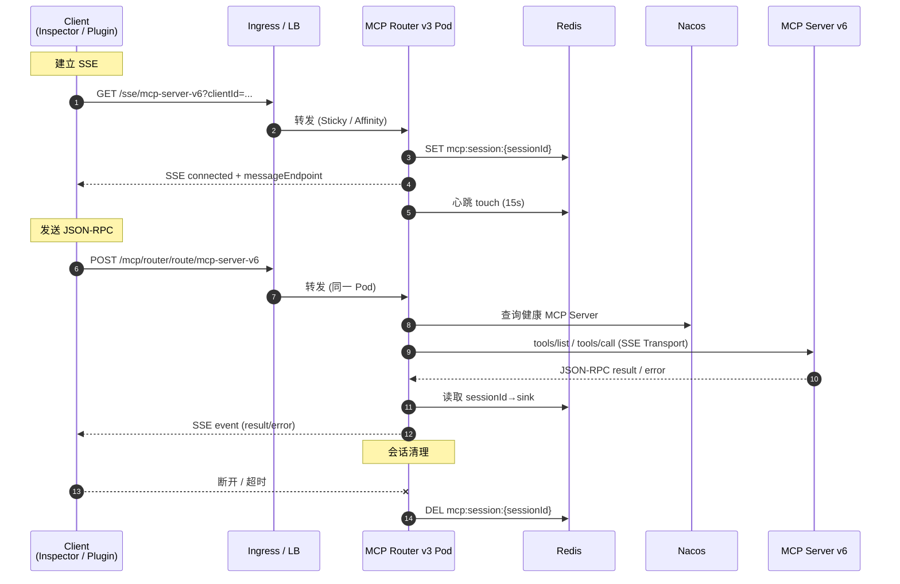

# MCP Router & Server Session Flow (Ingress Deployment)

本文档详细描述生产环境下（通过 Kubernetes Ingress 暴露服务）MCP Router v3 与 MCP Server v6 之间的全链路会话管理机制。内容覆盖 SSE 会话建立、REST 请求路由、Redis 会话存储、客户端桥接和 Ingress 相关的关键配置要求，帮助运维和开发团队理解系统行为并排查问题。

---

## 1. 整体拓扑

```
客户端 (MCP Inspector / VSCode MCP 插件 / 自定义客户端)
      │
      ▼
Kubernetes Ingress (L7 负载均衡 / TLS / WAF / Sticky Cookie)
      │
      ▼
Service → MCP Router v3 Pod(s)
      │               │
      │               ├─ Redis (Session/Bridge/Heartbeat)
      │               └─ Nacos (服务发现)
      │
      ▼
Nacos 注册的 MCP Server v6 Pod(s)
```

- **Ingress**：提供公网入口、TLS 终止、流量治理，可通过 Sticky Cookie 或 Session Affinity 保证 SSE 长连接落在同一 Router Pod 上。
- **MCP Router v3**：负责 SSE Session 管理、请求路由、桥接、心跳与指标采集。
- **Redis**：保存跨实例共享的会话映射（`sessionId → instanceId/service`）。
- **Nacos**：发现 MCP Server v6 实例并提供健康状态、元数据（SSE 端点、消息端点、权重等）。

---

## 1.1 端到端时序图



> **说明**：在生产环境中，Ingress 需确保长连接超时 ≥600s、禁用缓冲、开启粘性会话，以保证上图链路稳定。

---

## 2. SSE 会话生命周期

### 2.1 建立流程

1. **客户端 → Ingress**：发起 `GET /sse/mcp-server-v6?clientId=...`
2. **Ingress → Router Pod**：Ingress 根据策略（例如 IP Hash / Cookie Sticky）选择 Router Pod。
3. **Router (McpRouterServerConfig.handleSseWithServiceName)**
   - 生成 `sessionId`
   - 在内存中创建 `Sinks.Many<ServerSentEvent<String>>`
   - 同步注册到 `McpSessionService`（Redis：`mcp:session:{sessionId}` 保存 serviceName、instanceId、TTL）
   - 返回 `ServerSentEvent` 初始消息（告知消息端点 `http://<base>/mcp/mcp-server-v6/message?sessionId=...`）
4. **心跳**：`Flux.interval(15s)` 发送 `event: heartbeat`，并调用 `sessionService.touch(sessionId)` 更新 Redis TTL。

### 2.2 事件流

- **客户端 → Router**：将 JSON-RPC 请求（`initialize`/`tools/call` 等）POST 到 `/mcp/router/...`。
- **Router → Nacos**：选择目标 MCP Server v6。
- **Router → MCP Server**：通过 `McpClientManager` 的 SSE Client Transport 建立/复用连接。
- **响应回流**：Router 收到结果后，通过 `sessionId` 查找 `Sinks.Many`，发送 SSE 事件给客户端。

### 2.3 会话清理

清理触发路径：
- 客户端断开（`doOnCancel`）：检查会话仍在 Redis→移除。
- 错误（`doOnError`）：记录原因、移除 Redis、释放 Sink。
- 正常完成（`doOnComplete`）或超时（`cleanupTimeoutSessions` Job）。

> **Ingress 注意**：需要关闭代理缓冲 (`proxy-buffering off`) 并将 `read_timeout` 设置 ≥ Router 的心跳间隔 * N（建议 ≥ 600s）。

---

## 3. REST 请求链路

1. **客户端** 调用 `POST /mcp/router/route/mcp-server-v6`（tools/call、initialize 等）。
2. **Router**：
   - 通过 Redis 判断 `sessionId ↔ Router Pod`，确保与 SSE 同实例交互。
   - `McpRouterService` 根据 `message.method` 和动态超时路由后端。
3. **MCP Server v6**：执行工具 / 资源查询。
4. **Router**：
   - 若请求来自 SSE 上下文 → 结果通过 SSE Sink 下发。
   - 若 REST 调用本身需要即时响应（例如 Admin API）→ 直接返回 HTTP Response。

---

## 4. Redis 数据结构

| Key | 示例 | 内容 |
|-----|------|------|
| `mcp:session:{sessionId}` | `mcp:session:db75e410...` | serviceName、routerInstance、clientId、TTL、heartbeatTimestamp |
| `mcp:session:heartbeat` | List/SortedSet | 最近心跳，用于监控 |
| `mcp:bridge:{sessionId}` |  | 对应 `McpSessionBridgeService` 的推理/工具调用桥接状态 |

- TTL 由心跳刷新；默认 30 分钟，可通过 `sessionService.touch` 调整。
- 多实例 Router 共享 Redis，可支持故障转移（Ingress 需结合 `ip_hash` / Sticky Cookie，防止频繁漂移）。

---

## 5. Ingress 配置建议

```yaml
apiVersion: networking.k8s.io/v1
kind: Ingress
metadata:
  annotations:
    nginx.ingress.kubernetes.io/proxy-read-timeout: "600"
    nginx.ingress.kubernetes.io/proxy-send-timeout: "600"
    nginx.ingress.kubernetes.io/proxy-buffering: "off"
    nginx.ingress.kubernetes.io/enable-sticky-session: "true"   # 若使用 NGINX Ingress
spec:
  rules:
  - host: mcp-bridge.prod.example.com
    http:
      paths:
      - path: /
        pathType: Prefix
        backend:
          service:
            name: mcp-router-service
            port:
              number: 80
```

- 如果使用 **非 NGINX** Ingress（如 Istio Gateway、Traefik），同样需要：
  - 关闭缓冲
  - 长连接超时 ≥10 分钟
  - Sticky Session（基于 Cookie/IP/Session Affinity）

---

## 6. 常见问题与排查

| 问题 | 可能原因 | 排查要点 |
|------|----------|----------|
| SSE 频繁断开 | Ingress 未 Sticky / 超时过短 / 客户端超时 | 检查 Ingress 注解、心跳日志；使用 `test-sse-stability.sh` 验证 |
| 初始化响应延迟 | SSE Sink 尚未注册 / Redis 读写慢 | `McpSessionService.waitForSseSink` 日志；Redis RTT；Nacos 查询耗时 |
| REST 请求无响应 | Router 与 SSE 不在同一实例 | Sticky Session、Redis 映射、`mcp:session:{id}` 中 routerInstance 是否匹配 |
| 会话泄露 | 客户端未断开 / 节点异常 | `cleanupTimeoutSessions` 定时任务、Redis TTL、`logs/...` 中 `SSE connection cancelled` 统计 |

---

## 7. 工具脚本

- `scripts/test-sse-stability.sh`：长时间 SSE 稳定性测试（可在生产旁路环境运行）。
- `scripts/analyze-sse-disconnects.sh`：统计日志中的 SSE 建立、断开、错误，识别模式。
- `scripts/restart-nginx.sh`（仅本地调试使用）：生产 Ingress 由 Kubernetes 管理，此脚本仅用于本地 Nginx 模拟。

---

## 8. 关键源码参考

| 组件 | 文件 | 说明 |
|------|------|------|
| SSE Server 实现 | `src/main/java/com/pajk/mcpbridge/core/config/McpRouterServerConfig.java` | SSE 路由、心跳、事件流合并、会话清理处理 |
| SSE 会话存储 | `src/main/java/com/pajk/mcpbridge/core/service/McpSessionService.java` | Redis 映射、TTL、Sink 注册与等待 |
| SSE 桥接 | `src/main/java/com/pajk/mcpbridge/core/service/McpSessionBridgeService.java` | Router 与 MCP Server 之间的桥接会话 |
| 客户端 SSE（Router → MCP Server） | `src/main/java/com/pajk/mcpbridge/core/service/McpClientManager.java` | 使用 `WebFluxSseClientTransport` 建立到 Server v6 的 SSE |
| Nacos 发现 | `src/main/java/com/pajk/mcpbridge/core/service/McpServerRegistry.java` | 健康实例查询、缓存 |

---

## 9. 运维 checklist

1. **Ingress**：确认超时、缓冲、粘性设置。
2. **Redis**：监控 `mcp:session:*` 键数量、过期、延迟。
3. **Nacos**：确保 MCP Server v6 注册正常、健康状态为 `UP`。
4. **Router Pod**：监控 CPU/内存，避免 GC 影响 SSE。
5. **日志聚合**：集中采集 `SSE connection subscribed/cancelled/error` 日志，便于统计断开率。
6. **客户端文档**：要求客户端实现合理的重连与超时策略。

---

如需更细致的时序图或生产演练脚本，可在 `docs/` 目录下继续扩展。
